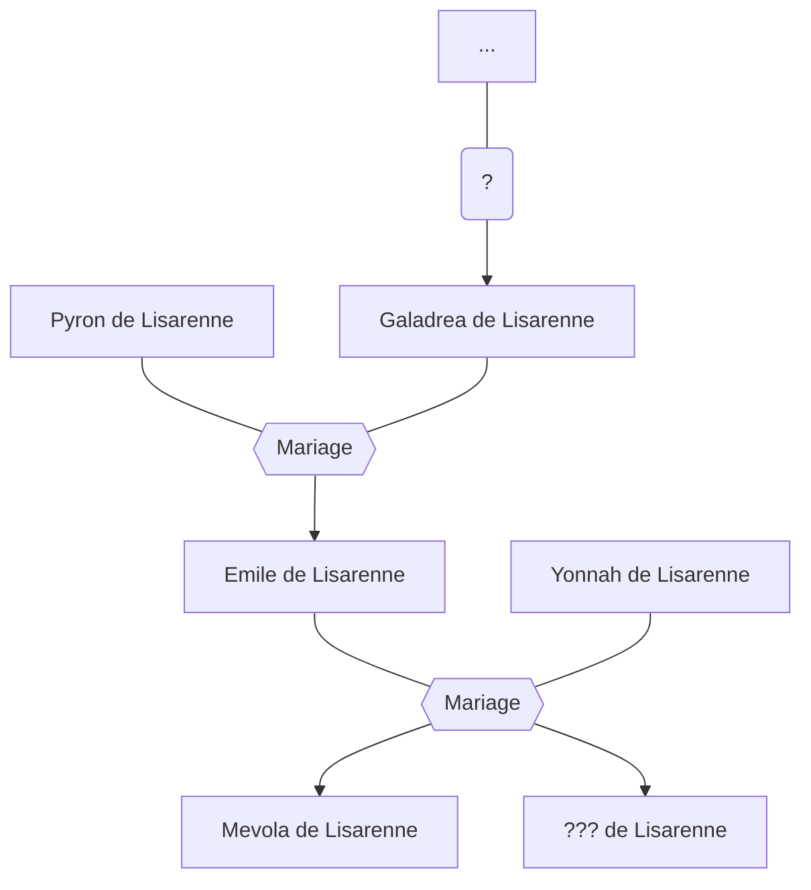

#Personnage/Mortel 
#Compagnie5Get1C

# Mevola de Lisarenne

## Informations personnelles

### Nom Complet
Mevola Galadrea Kainé Julia de Lisarenne

### Pronoms
Elle/Elle

### Titres
Héritière de la baronnerie De Lisarenne

### Alias
Accord (en tant que barde sur les routes)
Pensée d'Ista (en tant que barde de cour)

### Type de créature
Humanoïde

### Race
Tiefling

### Classe
Barde 3

### Alignement
Loyal Mauvais

Pour Mevola, la fin justifie les moyens. Si elle doit sacrifier la moitié de l’humanité pour ramener sa soeur, elle le fera sans hésiter. Elle n’a aucune réticence à se servir de la torture, du chantage et/ou du meurtre mais n’agit dans ce sens que si elle estime que c’est nécessaire.

### Status
Vivante

### Naissance
14 de Doufoyer 1763 (Troisième Age)

### Décès
Vivante

### Résidence
Les routes
Domaine De Lisarenne, Landgrave de Falefone, [[Empire Kinfordien]] (occasionel)
Académie arcanique de Tricaren, [[Empire Kinfordien]] (anciennement)

### Occupation
Barde, Aventurière, Héritière, Savante

## Histoire
### Avant la campagne
Malgré quelques ombres au tableau, l’enfance de Mevola De Lisarenne fut relativement heureuse. Née dans une des nombreuses petites baronneries de campagne  de l’Empire, fille de nobles (Emile et Yonnah de Lisarenne), elle et sa soeur jumelle purent bénéficier d’un environnement confortable durant leurs jeunes années.
Un splendide château empli d’histoire et de secrets, à la bibliothèque bien fournie, entouré par des collines à perte de vue. Des tuteurs privés leur enseignant les arts et les sciences, dans le but d’en faire des héritières dignes de ce nom. Des parents aimants, présents et heureux en ménage, bref la belle vie.
Seule tache sur cette peinture idyllique, malgré le fait qu’elles soient nés de parents humain et tiennent très visiblement des deux, les jumelles sont des tiefelines. Bien que de nombreuses explication aient été avancées (ancêtre ayant fait un pacte avec un démon, le sang très ancien des deux familles, une malédiction, un dieu chafouin ce jour-là) aucune réelle réponse ne fut jamais trouvé. Les parents firent faire aux soeurs des pendentifs jumeaux qui cachaient par magie les traits tiefelins de leurs enfants, leur évitant ainsi de subir regards, question, harcèlement, et quolibets.

Mevola fut donc éduquée en tout, bien qu’elle montra spécifiquement un talent pour les arts musicaux, notamment le luth et le chant, l’histoire et la magie. Durant son adolescence elle étudia les sciences arcaniques avec assiduité afin de rejoindre l’Académie Arcanique de Tricaren avec sa soeur, elle aussi doué dans le domaine mais étant du reste bien plus versée dans les sciences naturelles et politiques. Elles espéraient ainsi parachever leur formation, la première se destinant à devenir historienne ou maitre archiviste au service de l’empereur tandis que la deuxième, avec ses compétences en politique, reprendrais le domaine familial.

Mais le jour de ses 18 ans, un mois avant son départ pour l’académie, Mevola se réveilla seule dans sa chambre. Curieuse de savoir où était passée sa soeur, dont les affaires et le lit s’étaient volatilisés, elle demanda aux serviteurs, puis à ses parents puis à quiconque passait à sa portée si ils avaient vu l’autre tiefeline. Mais personne ne puis lui répondre autre chose que « Je ne vois pas de quoi vous parlez, vous n’avez pas de soeur. Vous sentez-vous bien ? ». Mevola se rendit alors compte qu’elle-même ne se souvenait plus du nom de la personne avec qui elle avait passé toute sa vie. L’autre fille De Lisarenne semblait avoir été effacée de la réalité, toute trace de son existence réduite à néant. La crise de folie de Mevola fut mis sur le compte de la fatigue et du stress précédant l’entrée à l’académie, et l’affaire en resta là.

Un mois plus tard la jeune fille fit ses valises l’Académie Arcanique de Tricaren. Elle avait cette fois-ci un but très différent. Amasser un maximum d’informations sur les dieux, démons, puissances extérieures et magies capable d’annihiler l’existence même d’un individu.

Elle resta 5 ans à l’académie. Durant ceux-ci elle perfectionna ses connaissances en musique (afin de garder et chérir le souvenir des nombreux après-midi passées à chanter en duo avec sa soeur sous un arbre ou dans le salon du château De Lisarenne) ainsi qu’en magie d’enchantement et d’illusion. Cependant, comprenant bien vite qu’elle ne trouverais pas ce qu’elle voulait dans les bibliothèques « officielles » Mevola se décida à prendre la route et voyager de par le monde suivant les rumeurs et les légendes populaires, séduisant des nobles et des érudits afin d’accéder à leur collections privées, chassant les djins et les forces occultes. Elle prit le nom de scène de « Accord » et le pseudonyme de « Pensée d’Ista » lorsqu’elle joue pour des nobles.

Cela fait maintenant 7 ans qu’elle voyage. Elle passe régulièrement visiter sa famille qui s’inquiète de la voir ainsi s’exposer au danger et ne pas honorer ses responsabilités en tant qu’héritière. Pour les rassurer, elle leur a promis qu’elle accourrait au moindre problème et qu’elle s’occuperait bien du domaine familial quand ils seront trop vieux pour le faire. Consciencieuse, elle essaye tant bien que mal de s’intéresser à des ouvrages politiques pour s’y préparer bien que le sujet n’ait jamais été son fort. Son temps est donc compté et en 12 ans l’obsession qu’elle a pour ce mystère ne s’est que renforcée. Elle mis à l’écart famille, amis, et sujets pour poursuivre son but, peut-être par peur que si elle se reprend à aimer quelqu’un comme elle aimait sa soeur, cette personne disparaisse à son tour. Une chose est sûr, Mevola de Lisarenne n’est pas au bout de ses peines.

### La vérité
Il y a bien des années, une femme a [fait quelque chose]. Cela a provoqué le courroux [d’un dieu].
Pour la punir, à sa mort, il la fit réincarner en une tiefelin née de parents humains.
Elle vécut certes une enfance heureuse, durant laquelle elle développa une relation romantique avec l'une des jeunes filles de la cour qui avait son âge, mais lors de son 18ème anniversaire, de faux souvenir lui furent implantés, la convainquant qu’elle avait grandi non pas en compagnie de celle-ci, mais d'une soeur jumelle.
Le reste de sa vie ne sera alors que tourment, comme sa vie précédente. En effet, ce cycle dure depuis des siècles et, chaque fois, le tortionnaire se montrent très créatifs pour concocter des façon toujours plus originales de faire de son existence un enfer. Aujourd'hui, c'st sa soeur qui n'existepas, ayant supplanté dans son esprit celle qu'elle aimait tendrement. Mevola pourra-elle briser la malédiction, ou connaitre les origines de celle-ci ?

## Description

### Apparence
Mevola apparait au commun des mortels comme une femme humaine d'une trentaine d'année, à la peau pâle et aux cheveux violets. Elle a un visage au traits légèrements marqués. Elle mesure 1m72. Ses yeux sont de la même couleur que ses cheveux. Elle porte le plus souvent une tenue de voyage noire jaune et brune. Lorsqu'elle fait des représentations, elle est vétue d'une robe rouge et jaune.

Sous sa véritable apparence, Mevola arbore une double paire de corne violette assorties à sa peau. Sa chevelure est d'un blanc cendré et ses yeux d'un rouge uniforme. Elle porte le plus souvent un masque en plus de ses vêtements habituels, pour cacher son visage et éviter d'être recconue.

### Personnalité
Mevola apparait comme une femme charmante, sociable et mystérieuse qui cache une personnalité beaucoup plus froide et méthodique. Elle est intelligente et sait mentir à autrui tout en présentant un visage d’ange. Elle est aussi une musicienne douée au luth, à la flute de pan, et au chant. Cependant, elle peut s’énerver très vite lorsqu’elle n’est pas (et même parfois lorsqu’elle est) dans son rôle. Elle a un fort penchant pour la boisson et une tendance à l’apathie vis-à-vis des problèmes des autres. Cependant, si elle s’investit dans la vie d’autrui, elle aidera avec un grand machiavélisme au dépens de l’avis de la personne concerné. De façon générale, elle essaye de régler ses problèmes de la façon la plus efficace possible.

## Capacités
Magie.

Luth, flute, tambours, chant.

Connaissances historiques, arcaniques, occultes et religieuses.

## Relations

### Famille
Emile de Lisarenne (Père)

Yonnah de Lisarenne (Mère)

??? de Lisarenne (Soeur)

### Relations amoureuses
Aucune

### Amis
Anémone Tirenbout, Mage (Transmutation), ancienne camarade d'académie et musicienne à ses heures perdues.

William de Lotwatch, Warlock, ancien camarade d'académie et amateur d'occulte.

Tressa Fallenpie, Halfling, Mage (Evocation), une archiviste à la bibliothèque de l'académie.

??? de Lisarenne (meilleure amie)

### Alliés et Affiliations
Académie arcanique de Tricaren (en qualité d'ancienne élève).

Maison de Lisarenne (héritière)

Empire Kinfordien (noble mineure)

### Ennemis
Royaumme de Whiteford (en qualité de noble de l'Empire)

### Autres relations
Malicieux (Barde avec qui elle a entretenu une petite rivalité)

Aolis Miséliandre, sa servante lorsqu'elle vivait au chateau.

## Arbre Généalogique

## Citations

## Galerie

Portrait de Mevola dans sa véritable apparence
![[Mevola Accord De Lisarenne-portrait.png]]
Token de Mevola dans sa véritable apparence
![[Mevola Accord De Lisarenne-Token.png]]
Portrait de Mevola en costume de scène
![[Mevola Costumed-portrait.png]]
Token de Mevola en costume de scène
![[Mevola Costumed-Token.png]]
Portrait de Mevola en tant qu'aventurière
![[Mevola Disguised-portrait.png]]
Token de Mevola en tant qu'aventurière
![[Mevola Disguised-Token.png]]
Artwork de Mevola en tant qu'aventurière
![[Mevola_Disguised-portrait.jpg]]
Portrait de Mevola dans sa véritable apparence
![[Mevola-portrait.jpg]]

## Anecdotes

Son endroit préféré est une bonne bibliothèque.
Elle lit des romans d’aventure dans son temps libre.
Son luth et son collier sont ses deux possessions les plus importants.
