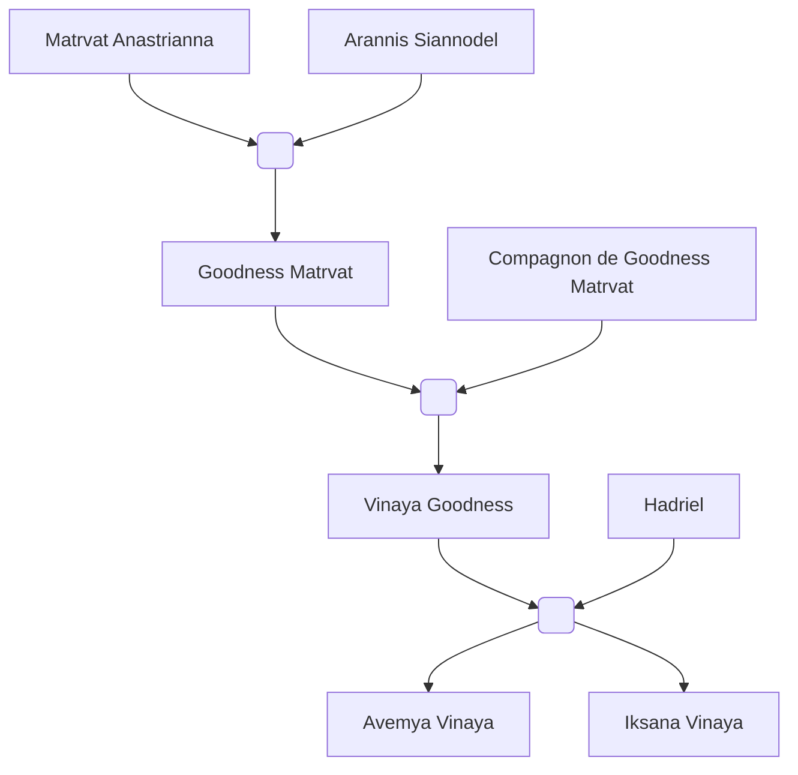

#Personnage/Immortel
#Compagnie

# Iksana Vinaya

## Apparence

## Informations personnelles
### Nom Complet
### Pronoms
### Titres
### Alias
### Type de créature
### Race
### Classe %%(le cas échéant)%%
### Alignement
### Status
### Naissance
Née à [[Cragwell]].

### Décès
### Résidence
### Occupations

## Histoire

## Description
### Apparence

### Personnalité

## Capacités

## Relations
### Famille
Fille de [[Vinaya Goodness]] et du Deva [[Édos|Hadriel]]
Sœur d'[[Avemya Vinaya]].
### Relations amoureuses
Amie, amoureuse et amante de [[Candrin Jvalaka]].
### Amis
### Alliés et Affiliations
### Ennemis
### Autres relations

## Arbre Généalogique

## Citations

## Galerie
![[Attachements/PC/Iksana/Avatar.jpg]]
![[Vinaya_token_2.png]]

## Anecdotes
