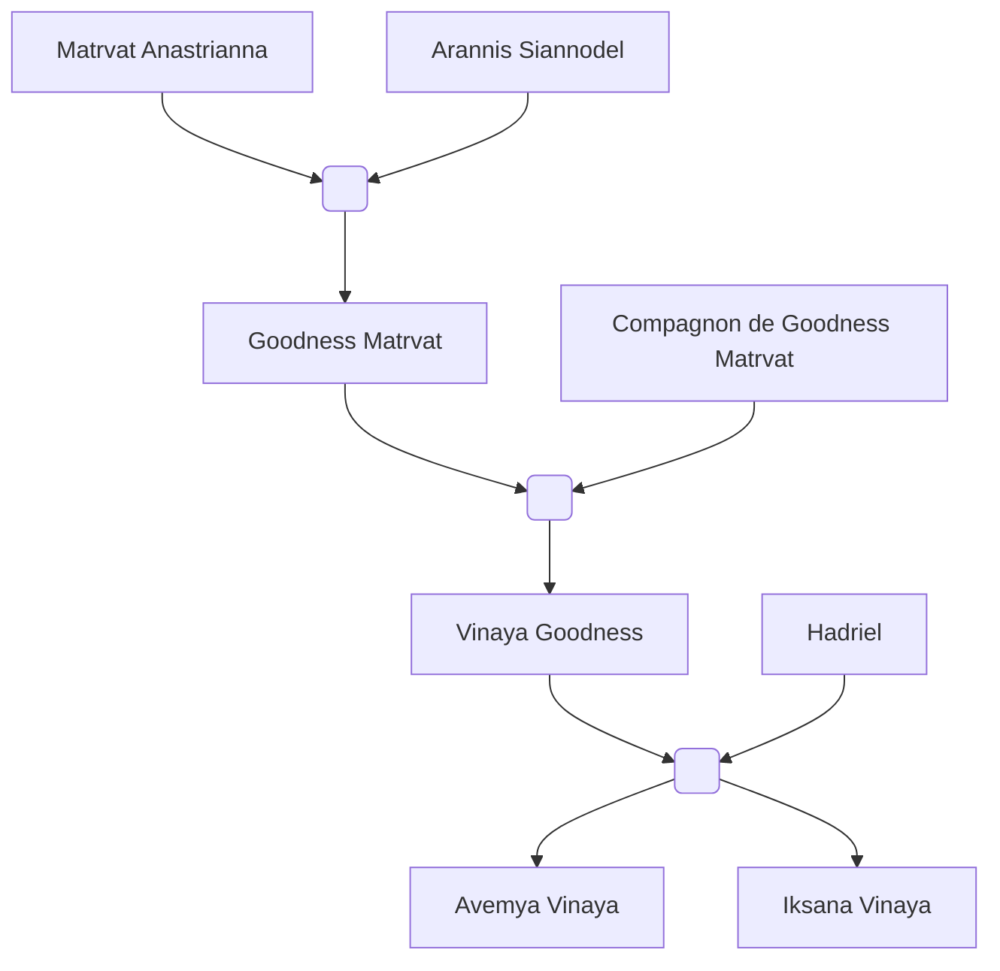

#Personnage/Immortel
#Compagnie

# Iksana Vinaya

## Apparence

## *Informations personnelles*
### Nom Complet
Iksana Vinaya

### Pronoms
Elle, Féminin
### Titres
Doctoresse
### Alias
### Type de créature
Humanoïde
### Race
Tieffelin
### Classe
Magicienne de l'école de la divination
### Alignement
Neutre Bon
### Status
Vivante
### Naissance
Le 6 septembre 771 de l'ère Kinford, à Amangassuaq. 

### Résidence
[[Cragwell]]
### Occupations
Aventurière

## Histoire
Iksana Vinaya est née en 771 K à Amangassuaq, elle habitait dans ce village avec ses arrières-grand-parents, sa grand-mère, sa mère, et sa grande-soeur et fut la dernière de la famille.

Tout comme la majorité de sa famille, elle fut une Tieffelin, seuls exceptions furent les arrières-grands-parents qui eut sont des elfes du soleil.

Sa famille était la seul comprenant des tieffelins, et donc cela venait avec son lot d'inconvéniences mais Iksana eut la chance de vivre dans un environnement relativement sain, surtout grâce au travail de sa mère pour avoir une si bonne réputation.
C'est d'ailleurs grâce à cette volonté d'aider qu'Iksana fut aussi gentille, aussi prête à aider son prochain bien qu'elle fut des plus solitaires, préférant apprendre un maximum de choses aux côtés de sa famille.

Aussi tôt qu'elle apprit à lire, la jeune fille fut fascinée par la magie. Mais hélas contrairement au reste de sa famille, elle n'eut pas de dons. Elle était la seule qui n'était pas une ensorceleuse du brasier éternel. Ses seuls pouvoir magique furent ceux provenant de sa lignée de tieffelin.
Bien sûr elle fut attristée par cette nouvelle et cela fut remarqué par toute sa famille qui s'empressait de la rassurée, de l'aider émotionnellement.

Mais pourtant, la fascination de la magie ne fut pas effacée, c'est donc lors de son adolescence qu'elle s'intéressa au monde des magiciens. Apprenant qu'il s'agissait d'une option, sa famille ne fit que l'encourager pour la pousser dans ces études.
C'est à la même époque qu'Avemya, sa grande-soeur, décida de partir dans sa propre voix, clamant qu'elle avait besoin d'aventures et de voyages.

Iksana fut inscrite à l'académie de Cragwell, et avant de partir pour ses études et vivre dans l'internat, sa mère lui confit un parchemin. Bien que cette dernière ne dit mot, ses yeux remplis d'une anxiété des plus profondes parlait à sa place.
Ainsi fut transmis l'importance et la lourdeur de ce qui fut remis. Iksana comprit qu'il devait s'agir d'un secret, mais surtout d'un lourd aux conséquences les plus dramatiques entre de mauvaises mains.
Une fois le cadeau transmis, les deux femmes agissèrent comme de rien n'était.

Les études d'arcane d'Iksana commencèrent, elle montra une forte détermination dans chaque domaine. Son envie de se dévouer à son prochain fut tel qu'elle doubla son doctorat d'arcane avec un doctorat en médecine. 
Son désir d'en apprendre toujours plus la suivait, elle devait toujours se surpasser, toujours se dépasser.

Mais hélas pour cette jeune fille en soif de savoir, elle était dans un milieu où elle n'était qu'une inconnue, et les craintes qu'éprouvaient cette jeune fille se réalisèrent toute une à une.
Iksana fut crainte, évitée, une femme au corps de démon n'était qu'une erreur de la nature pour ces autres étudiants.
Des insultes de plus en plus sévères furent lancés à la gueule de la seule tieffelin des environs. 
Des attaques avaient lieu bien que très rarement, bien que dans la grande majorité des cas, Iksana purent les éviter ou les contrer. Après tout la divination était le domaine qu'elle excellait particulièrement, heureusement qu'il s'agissait de la spécialité de l'académie.
Tout ce harcèlement qu'elle se prenait ne rendit la jeune tieffelin plus distante et maladroite dans les situations sociales.

Mais un jour, ces aboiements que cette jeune magicienne subissait prirent une tournure des plus extrêmes.
Un énorme groupe d'étudiants avaient encerclé la "démone", tous avec un sourire au coin des lèvres.
Pendant des heures, cette jeune femme subissait les attaques effrénées de ses "collègues". 
Son corps subit tous les éléments, la grande douleur que la tieffelin subissait était d'une grande intensité et constante.
Alors que dans la tête de la jeune femme, la seule pensée qu'elle arrivait à produire n'était qu'à quel point sa mort était proche, elle n'entendit plus rien.

Un silence assourdissant vrombissait dans son crâne. Ses pensées furent éliminés, le moindre bruit extérieur avait disparu.

Ce "silence" se mit à parler à Iksana, ne disant que de simples mots en boucles.

"Relève-toi ma fille, et rends-moi fière."

Cette voix d'inconnue n'arrêtait pas de dire ces paroles. C'est alors que nacquit une colère dans le coeur d'Iksana.
Pendant un bref instant où les attaques se stoppèrent, le corps de la tieffelin bougea seul. Seul le corps fut animé, la conscience de l'étudiante s'estompa pour laisser contrôle à cette voix.

Les mains, paume au sol, se resserraient et attrapèrent un tas d'herbes avant qu'une odeur de crâmé s'échappa des mains de la jeune démone. 
Le feu se mit à se propager sur l'herbe, les flammes grandirent au fur et à mesure que la tieffelin se relevait.
Son dos se redressait, laissant que sa tête et son corps "détendu".
La femme releva enfin la tête, et des yeux d'un noir pure sans même la réflexion de la lumière furent dévoilés.
Les flammes gigantesques qui entouraient la jeune fille devinrent violettes. Le corps attrapa violemment une de ces flammes et sembla comme s'habiller avec.
La tieffelin avait un manteau de flammes et sa voix se mit à résonner si fort qu'elle en fit vriller les tympans.
« Comment osez-vous vous en prendre à ma lignée ! Ceci est votre dernière chance, faites un geste hostile et vous subirez des conséquences à la hauteur de vos péchés ! »
De nombreux étudiants qui l'avaient attaqués furent pendant un instant paralysé par cette peur aux allures divines.
Malgré cette allure terrifiante, un cri de guerre fut poussé par un des mages :
"Allez les gars ! C'est maintenant si on veut éradiquer ce démon !"

Le jeune homme commença à faire les gestes, il prononça l'incantation, le sort parti.
Iksana leva simplement la main et arrêta le trait de feu avec sa paume encore brûlante.
Ce même jeune homme commença à faire un autre sort, il ne put prononcé qu'une syllabe avant qu'Iksana fut devant lui à lui tenir par la gorge et le souleva légèrement, ne lui laissant que la pointe des pieds aux sols.

La tête de la tieffelin se pencha sur le côté.
"Et ainsi, le pêcheur fut puni."

La paume d'Iksana monta en température, encore et encore. Son sang bouilla et avec, une lueur orange  incandescente s'emana de la main.
Des cris de douleurs s'échappèrent du jeune homme alors que sa gorge se faisait brûler vif.
Après une simple demi-minute qui paraissait durer des heures pour la victime, cette dernière fut lâcher et tomba violemment au sol.

Une deuxième personne tenta un sort mais cette fois-ci "Iksana" ne lui laissa même pas le temps de terminer une première fois. Elle utilisa la pointe de sa queue étonnemment tranchante pour couper l'avant-bras.
Blessée, elle fuya de peur de finir comme son ami, s'en suivit de cette horde d'aissaillants, apeuré par cette aura de peur qui émanait de ce corps démoniaque.

Elle fut enfin de nouveaux seuls dans cette cour d'herbes, entourée de cette odeur de crâmée.
Une fois la solitude confirmée, le manteau de flamme disparut, les yeux revinrent à la normal et Iksana tomba violemment à genoux, tentant desespéremment de rester éveillée avant que son corps la lâche.

Avant de perdre conscience, elle sentit une force la soulever, une force bienveillante. Lorsque la tieffelin tenta de regarder de qui s'agissait-il, elle se retrouvait éblouie par le soleil qui cachait tous les détails du visage de l'inconnue.

Lorsqu'Iksana se réveilla enfin de son coma, une nuit sans lune se dressait à travers la fenêtre de l'infirmerie.
La jeune tieffelin était recouvert de nombreux bandages sur tout le corps, seul sa tête était libre.
La seule chose qu'elle arrivait à voir dans cette infirmerie était cette jeune femme aux cheveux d'or assise à son chevet, le haut du corps avachit sur le mur, faisant face à Iksana.
C'était la seule personne ici et semblait dormir avec une expression inquiète gravée sur le visage.

La tieffelin regarda le plafond, tentant de se rappeler ce qu'il s'était passé après avoir entendue cette voix, mais ne ressentit qu'une migraine des plus atroces.
Alors qu'Iksana tenta de bouger pour se masser les tempes, la jeune femme se réveilla presque en sursaut. Elle se frotta les yeux, se demandant clairement si sa vision ne l'a trompait pas avant de soupirer de soulagement.
"Par les dieux, tu es réveillée..."
Iksana, confuse, ne répondit que par un "B-Bonsoir...?"
"-Oh excuses-moi, je suis celle qui t'a ramené ici après ton évanouissement.
Tu leurs as foutus la pire peur de leur vie, tu devrais être tranquille.", finissait-elle par rire finement.
Iksana n'était que trop confuse pour répondre. L'anxiété qu'elle éprouvait lui disait que cette jeune fille allait à son tour l'attaquer.

"P...Pourquoi t'as......t'as fais ça ? Et pas comme les autres qui voulaient me sauter à la gorge ?"
La voix d'Iksana avait encore des traces de sa colère, du ressentiment qu'elle avait vécu sous les feux de ses ennemis.

"Parce...parce que t'as rien fait pour mériter ce traitement ? J'veux dire, t'es clairement la plus investie ici, t'es une source de motivation et en plus ton spectacle était magnifique. Je vois pas ce que je devrais avoir besoin de plus pour ça."

Un simple "Oh ...euh...je vois...merci" sortit de la bouche de la jeune tieffelin avant qu'un moment de silence des plus gênant s'installa.

...

Candrin se leva enfin et se prépara à partir avant de dire :
"Oh j’oubliais, le médecin a dit que tes blessures sont surtout superficielles. Tu risques d’avoir des cicatrices mais par chance la potion a soigné les terminaisons nerveuses."

Iksana remercia une fois de plus. Alors qu'elle vit sa sauveuse partir, des larmes se mirent à couler le long de son visage et sa respiration était haletante.
La jeune tieffelin avait peur de rester seule, elle attrapa la manche de la et lui demanda de rester.
La demi-elfe blonde souria des plus chaleureusement avant d'accepter. Elle bougea le lit d'à côté pour le juxtaposé à celui de la tieffelin.

"Faudrait peut-être se présenter maintenant qu'on va dormir ensemble, moi c'est Candrin Jvalaka, mais appelle moi Candrin."
-"M-moi c'est...c'est Iksana Vinaya, mais euh tu...tu peux m'appeler par Iksana."

Le nom de Candrin signifiait "Lumière dorée.", une signification qui lui allait à merveille.

Pendant la convalescence d'Iksana, Candrin lui apport tous les cours, les deux discutaient ensemble et devinrent des amis inséparables. Les deux étudiantes formait un duo avec une synergie dont beaucoup enviait.
De par leur maîtrise de l'arcane et leur dévouement, le duo fut connut dans l'établissement en tant que "Astres miroirs".

Pour Iksana, il s'agissait de sa première amitié aussi profonde, et le début d'une suite de créations d'amis. La vie de la jeune tieffelin avait complètement changé.
Elle développa des sentiments amoureux pour sa meilleure amie, mais hélas, pensant qu'ils étaient à sens unique, ne les dévoilera jamais.

Les années avancèrent, les études arrivèrent à leur terme. Iksana avait finit son doctorat en arcane et en médecine avec un moyen de révolutionner la magie et retrouva sa famille pour leur annoncer la nouvelle.
Toute la famille fut réuni au complet, même Avemya qui était parti en aventures avait décidé de retrouver sa soeur pour cette évènement.
Toute la famille s'était cotisé pour acheter un cadeaux de félicitations pour orner la pointe de sa queue.
Un ornement en or pour habiller la pointe de sa queue de tieffelin, un bijou qui est devenu une tradition familial pour féliciter les pouvoirs d'un lanceur de sort.

Très rapidement, le désir d'aventures et d'explorations s'empara de la jeune docteuresse. C'est avec Candrin qu'elle décida d'explorer les terres.
Elles formaient un duo de magiciennes en quête de progrès personnel. Mais hélas, de par leur désir, les deux dûrent se séparer et prendre une voix séparé. En guise de cadeau d'au-revoir, elles s'offirent un médaillon en or en forme de soleil à moitié caché par une lune, le début d'une éclipse.
Elles développaient également un moyen de communiquer avec un aigle apprivoisé pour échanger des lettres.

Ce n'est alors que quelques mois plus tard qu'Iksana reçu une lettre des plus sombres.
Il s'agissait d'un appel à l'aide en lettre de sang. 

L'histoire des aventures d'Iksana débuta enfin.

## Description
### Apparence

Iksana est une tieffelin à la peau rouge-violacé, elle a une queue épaisse, des cornes en béliers, les cheveux noirs, des oreilles en pointe comme des elfes, et les yeux rouges-orangés sans scléra ni pupilles.
Elle a le corps criblés de cicatrices causés par de la foudre, du tonerre, du feu de l'acide et des coupures.
A la pointe de sa queue elle a un ornement en or.
Elle s'habille en vert avec une cape bordeau et des lannières et chaussures en cuir.
Ses canines sont plus grande que le reste de sa dentition, et ses lèvres sont naturellement violettes.

### Personnalité
Elle est terriblement ancieuse et maladroite dans les situations sociales bien qu'elle soit dévoué à aider son prochain.
Elle est tout de même une personne assez sage, disposée à écouter tous les arguments avant de faire son propre jugement.
Elle cherche constamment à s'améliorer.
Elle est fassciné par les démons, les infernaux les abysses, sûrement dû à sa nature de tieffelin qui la pousse en apprendre plus sur sa "culture".
Iksana est une magicienne prête à tout pour ce qu'elle considère comme "le plus grand bien", quitte à se mettre de côté, à négliger, ou bien prendre des décisions qui sonne comme terrible, du moment que cela apportera un bien global à la fin.

## Capacités
Maîtrise la magie de la divination, à un point où elle peut créer ses propres sorts.
## Relations
### Famille
[[Matrvat Anastrianna]] (Arrière-grand-mère)
[[Arannis Siannodel]] (Arrière-grand-père)
[[Goodness Matrvat]] (Grand-mère)
[[Vinaya Goodness]] (Mère)
[[Hadriel]] (Père)
[[Avemya Vinaya]] (Sœur)

### Relations amoureuses
[[Candrin Jvalaka]] (Amie, amoureuse et amante)

### Amis
Des amis d'études: Farryn, Soliana, Arlayna, Aneirin, Thyrapsir, Uqvae
### Alliés et Affiliations
Whitefordienne

### Ennemis
/
### Autres relations
Familier : Sandeza (aigle messager entre Candrin et Iksana)
Fiélon familier : Elvas

## Arbre Généalogique

## Citations

## Galerie
![[Attachements/PC/Iksana/Avatar.jpg]]
![[Vinaya_token_2.png]]

## Anecdotes
Iksana a un doctorat en Arcane et un en Médecine qu'elle a fait simultanément.
	A reçu le prix de l'élève exemplaire de son académie.

La première fois qu'elle a lancé "Représailles infernales" était parce qu'Avemya l'avait cogné en tournant au coin du couloir.
Bien qu'elle n'eut absolument pas mal, l'effet était impressionnant et c'est depuis cet incident qu'Iksana a compris comment l'utiliser.
