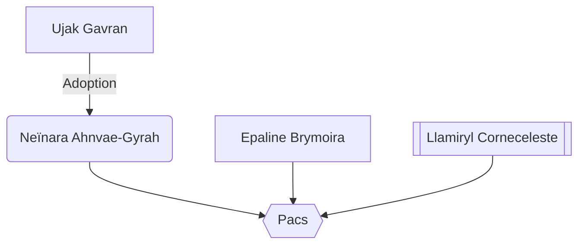

#Personnage/Mortel [[Mortel]]
#Compagnie-Douze [[Compagnie Douze]]

# Epaline Llamiryl

## Informations personnelles

### Nom Complet
~~Neïnara Ahnvae-Gyrah (Neïnara Oiseau de Nuit) (anciennement)~~
Epaline Llamiryl

### Pronoms
Elle

### Titres
Chevaleresse aux plumes noires (pour le temple d'Edos/ plus haut grade au temple de la Reine Corbeaux)

### Alias
La fine plume (liée à son titre)
La convocatrice  (temple de la reine corbeaux/ Chevaleresse)

### Type de créature

### Race
~~Satyr (anciennement)~~
~~Changeling (actuellement)~~
Elfe du soleil ~~(officiellement)~~

### Classe %%(le cas échéant)%%
Occultiste du pacte de la lame maudite

### Alignement
Loyal Neutre

### Status
Vivante

### Naissance
~~8 Closeporte 1751~~
12 Coeurazur 1773

### Décès
Toujours vivante, rassurez-vous, toujours la banane, toujours debout !

### Résidence
[[Monde féérique]] (anciennement)

### Occupation
Vagabonde, Aventurière

## Histoire
Elle était une satyre née dans le plan des fées et y vivait paisiblement, elle n’avait pas de noms car ayant été élevée uniquement par la nature.
À première vue, cette jeune satyre vivait une vie noble comme tant d’autres.
Très tôt lorsqu’elle n’avait que 14 ans, elle s’intéressa à la religion, la reine des corbeaux avait suscité son admiration, son admiration fut telle qu’un prêtre d’un couvent encore méconnue voulut la recruter, ce qu’elle accepta avec beaucoup d’enthousiasme.
C’est ainsi qu’un nom lui fut attribué : Neïnara
Cette jeune satyre fut accueillie les bras ouverts, elle fut éduquée et devint ainsi une paladine se dévouant au prêtre qui l’avait tant aidé.
Elle progressait à vue d’œil, et c’est lors de son vingtième anniversaire qu’elle fut promue pour devenir membre officiel de l’escouade du couvent.

Neïnara nageait en plein rêves, elle pouvait montrer sa dévotion au prêtre et donc par extension à la reine des corbeaux.
Les missions religieuses défilaient qu’elle remplissait avec plaisir, bien qu’elle trouvait la plupart assez particulière mais qu’elle acceptait facilement, pensant que c’était normal.

Ses aventures progressaient, Neïnara avait maintenant 44 ans et était une paladine de niveau 20, elle s’était fait également deux amis magiciennes, Epaline et Llamiryl, qu’elle appréciait tout particulièrement, si bien qu’à trois elles formaient un trouple.
Son couvent était devenue plus fort et avait maintenant de nombreux adeptes.
Ses amantes n’étaient pas plus au courant du couvent de la plus si jeune Neïnara, mais lors de la révélations, elles furent horrifiées.
Elles lui apprirent qu’il s’agissait d’une secte qu’elles cherchaient justement à détruire. 
Bien évidemment, Neïnara n’y crut pas un instant.
Les magiciennes lui montrèrent les preuves, et l’amena à un certain endroit.
Neïnara vit de ses propres yeux, le prêtre faire un rituel sacrificiel avec de nombreux enfants qu’il venait de trancher la gorge à la vue de tous.

Il était déjà trop tard lorsque la troupe vit la scène, le prêtre avait déjà gagné des pouvoirs immenses.

C’est ainsi que Neïnara brisa son serment. Sa haine était si forte qu’elle forma une aura sombre et de morosité, elle fonça sur ce prêtre qu’elle pensait d’un cœur pure.
Elle cria sans cesse « Ce n’est pas ce que la reine des corbeaux voulait ! Ce n’était pas ce qu’elle voulait ! » alors que les larmes coulaient sur ses joues.
D’autres servants arrivèrent pour protéger le prêtre, Neïnara les effrayaient tous à cause de son aspect terrifiant. Alors qu’ils étaient tétanisés, Neïnara les tuas.
Ses amantes magiciennes avaient enfin réussir à sortir de l’effroi que leur avait infligés la paladine et la soutinrent dans cette ultime bataille.

Neïnara compris ce qu’il se passait avec son serment lorsqu’elle, instinctivement, prononça «Réanimation des morts, niveau 5 »

Elle créa une petite armée de morts-vivants, tous venant s’attaquer au prêtre.

Ce fut long et difficile, à combattre une personne aussi puissante qu’une demi-divinité.
Pendant ce combat, le prêtre lui arracha le bras droit, mais Neïnara ne se laissa pas faire.
Elle fit un gigantesque bond pour récupérer son bras encore pleinement contracter  et l’enfoncer à travers le torse de gourou.

Neïnara rajouta une couche pour être sûre de l’avoir tuer et porta le coup final, son bras et maintenant son épée traversèrent complètement le torse de son ancienne figure paternelle.

À présent, elle était dégoûtée de ce qu’elle était. Cette pauvre satyre qui n’était que le fruit de tromperie et de manipulation de pouvait même pas se voir dans la glace.

Llamiryl lui proposa de lui faire une métamorphose suprême, ce qui lui permettrait de récupérer une identité complète. 
Neïnara choisit de devenir une fée, pour rester assez proche de son milieux, alors que le sort commença, une nouvelle salve d’adeptes arriva.
Elles tinrent pendant une heure. Mais les deux magiciennes comprirent que leur vies devaient se finir et qu’il était impossible pour elle de survivre.
Pour autant, les deux magiciennes se lancèrent un regard, dans tous les cas elles allaient bientôt mourir, mais seule Neïnara pourrait continuer de vivre.
Les deux étaient satisfaites de leur vécu, et décidèrent de changer les plans pour sauver Neïnara.

Llamiryl réussit à changer au dernier moment la transformation pour transformer Neïnara en changeling, pendant qu’Epaline créa un portail vers le plan matériel.
Neïnara ne se rendit pas compte du changement qu’elle avait subit et fut balancée dans le portail par Epaline.

Pendant le voyage, sa dernière vision fut ses deux amantes lui sourire alors qu’un souffle de feu emporta tout sur son chemin, avec un petit message «Vies pour nous, d’acc ?»

Elle se réveilla au milieu d’un champs, et pleura toutes les larmes de son corps.
Elle avait tout perdu, son serment qui lui avait octroyé une puissance incroyable, sa « famille », ses amours, et son identité.

Comment vivre dans de telles conditions ?

C’est alors qu’une figure apparut sous ses yeux, la nouvelle changeling reconnut immédiatement, il s’agissait de la reine des corbeaux.
La reine lui remercia d’avoir détruit un culte tâchant son nom, mais également d’avoir fait la bonne chose, et ainsi, pour remercier le dévouement, lui proposa un pacte.
Celle qui était personne accepta.

Heureuse, la reine partit sans laisser de traces mise à part les pouvoirs d’occultisme que possédait maintenant cette maintenant jeune femme.
Lorsqu’elle se concentra sur sa nouvelle vie, elle se rendit compte qu’un bras se mit à pousser depuis la zone amputée.
Ce bras avaient des yeux, des dents, une description qui était très similaire à celle d’un mimique, mais malgré cela, formait une main et des doigts. Le tout répondait parfaitement bien aux commandes de l’hôte, si bien que c’était comme s’il s’agissait de son propre bras.

En se relevant, cette jeune femme trouva dans ses affaires un portrait détaillée du trio qui venait d’être dissout. Elle serra cette photographie contre elle et pleura encore une fois.
Ne sachant plus qui elle était, et ayant perdu ce qu’elle considérait comme ses cœurs, elle décida d’honorer leurs vies et de modeler son apparence en leur honneur.
Elle n’arrêtait pas d’alterner entre prendre le corps de Llamiryl avec les tatouages d’Epaline, ou le corps d’Epaline et les tatouages de Llamiryl.
Cette dernière changea son apparence pour prendre le corps de Llamiryl et les tatouages d’Epaline, sur tout son corps.
Elle décida de prendre leur noms pour se forger une nouvelle identité mais également d'alterner son corps quand elle le peu pour continuer de se rappeler de ses amours. 

## Description
### Apparence
Epaline est une grande elfe du soleil d'1m80, elle a des cheveux longs noir mi-long fortement bouclés.
Elle a un oeil noir et un oeil vert, a plusieurs piercings dorées sur ses longues oreilles.
Elle a énormément de tatouages dorées sur tout le corps, notamment sur le visage.
Elle porte un beret de cuir, une longue veste bleutée cachant sa côte de maille, ainsi qu'un pantalon et des chaussures bleues.
Sur le bas du dos de sa veste, elle a une lannière de cuir qui forme un noeud (façon noeud papillon).

### Personnalité
Epaline est une femme à tendance calme et réservée, qui fait tout pour être polie et courtois. 
Elle aborde des aires vaniteux, charmeuses, jouant de tout pour montrer qu'elle est supérieure de par ses atouts.

Elle cache en réalité une personnalité craintive, doutant de tous ceux qui l'entourent, elle a du mal à faire confiance aux autres mais leur fera croire le contraire.
Mais malgré tout ça, son honneur de combattante restera son trésor le plus précieux.

Elle cherche désespéremment qui elle est, ce qu'elle est sensée faire dans ce monde, et utilisera ses dons pour trouver une identité qui la correspond.
## Capacités
Maîtrise de toutes armes, de bouclier et d'armures légères et moyennes.

Maîtresse de la persuasion, de la tromperie, du charme, et de l'intimidation.

Maîtrise du déguisement comme personne.
## Relations
### Famille
Père adoptif : Ujak Gavran
### Relations amoureuses
~~Epaline Brymoira~~
~~Llamiryl Corneceleste~~

### Alliés et Affiliations
L'église du crépuscule / De la reine Corbeaux / d'Edos

### Ennemis
Les sectes...

De manière général...

Putain de sectes de merde ! >:(
Et les ennemis de l'église d'Edos évidemment

## Arbre Généalogique

## Citations

## Galerie

Portrait d'Epaline
![[Epaline-portrait.png]]
Token d'Epaline
![[Epaline-Token.png]]

## Anecdotes