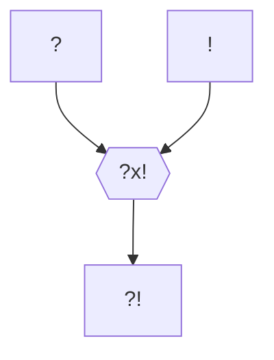

#Personnage/Mortel [[Mortel]]

## Informations personnelles
### Nom Complet
Melffy Lupus
### Pronoms
### Titres
### Alias
### Type de créature
Humanoïde
### Race
Drakéide d'améthyste
### Classe
Barbare
### Alignement
### Status
### Naissance
### Décès
### Résidence
### Occupation

## Histoire
Lupus Melffy a été élevé par des loups. D'aussi loin qu'il se souvienne, il a toujours été avec les loups, et ignore qu'il est peu commun pour un humanoïde, d'autant plus un drakéide, d'être élevé par des loups. Il a d'ailleurs hérité sa propension pour les câlins de sa meute.

Cette belle relation eut malheureusement une fin tragique. Sortant de l'enfance, il fit la rencontre d'esprits de la nature. Virevoltant dans le vent avec les esprits de l'air, se perdant parmi les arbres avec les esprits de la terre, jouant dans l'onde avec les esprits de l'eau, se réchauffant le soir auprès des esprits du feu, tout se passait pour le mieux.
Jusqu'au soir fatidique où, possédé par une entité spirituelle, après s'être endormi paisiblement, il se réveilla entouré de cendres, le corps de plusieurs loups, calcinés, reposant autour de lui. Il dû alors fuir la meute, découvrant au passage la civilisation, et se jurant à lui-même qu'un jour il vengerait les siens.

Bien plus tard, en essayant d'explorer la ville voisine, il fit la rencontre d'un nain voleur qui devint son mentor. Celui-ci lui apprit à parler le nain, les rudiments du combat et fut une partie de la raison pour laquelle Melffy développa des a priori peu flatteurs envers les elfes.
Cependant, contrairement a ce que Melffy croyait, ce nain était tout sauf une personne respectable. Vols, kidnapping, meurtre ou pire étaient dans ses habitudes. Il jouait juste un rôle devant Melffy, donnant lieu aux valeurs biaisées de ce dernier.

C'est quelque temps après qu'il se lança à l'aventure pour explorer le monde, dans le but premier d'exterminer le feu, afin de tarir celui qui l'anime.

## Description
### Apparence

### Personnalité

## Capacités

## Relations
### Famille
### Relations amoureuses
### Amis
### Alliés et Affiliations
### Foi
### Ennemis
### Autres relations

## Arbre Généalogique

## Citations

## Galerie

## Anecdotes