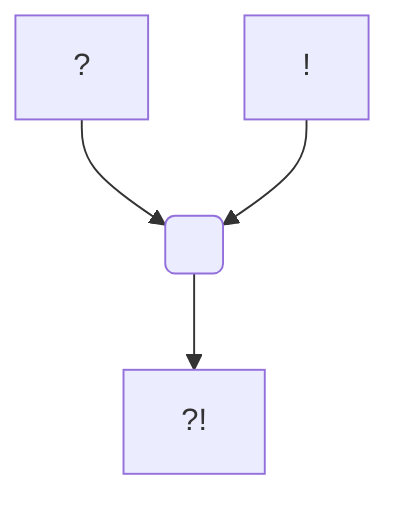

#Personnage/Mortel [[Mortel]]
#Compagnie-Douze [[Compagnie Douze]] 

# Talbour Illorel

## Informations personnelles
### Nom Complet
### Pronoms
### Titres
### Alias
### Type de créature
### Race
### Classe %%(le cas échéant)%%
### Alignement
### Status
### Naissance
### Décès
### Résidence
[[Diarchie de Baram]] (anciennement)
### Occupation

## Histoire

## Description
### Apparence

### Personnalité

## Capacités

## Relations
### Famille
### Relations amoureuses
### Amis
### Alliés et Affiliations
### Ennemis
### Autres relations

## Arbre Généalogique

## Citations

## Galerie

Portrait de Talbour
![[Talbour-portrait.png]]
Token de Talbour
![[Talbour-Token.png]]

## Anecdotes