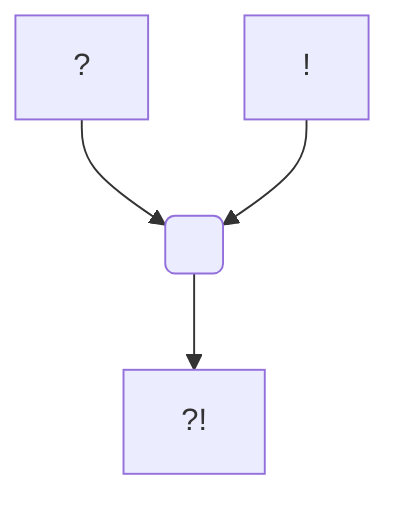

#Personnage/Mortel
#Compagnie

# Mordecai Noname

## Apparence

## Informations personnelles
### Nom Complet
Mordecai Noname

### Pronoms
### Titres
### Alias
### Type de créature
### Race
### Classe %%(le cas échéant)%%
### Alignement
### Status
### Naissance
### Décès
### Résidence
### Occupations

## Histoire

## Apparence

## Personnalité

## Capacités

## Relations
### Famille
\[REDACTED\] (Grand-père)

### Relations amoureuses
### Amis
### Alliés et Affiliations
[[Église du Crépuscule]] (Anciennement, ex-communié)

### Ennemis
### Autres relations

## Arbre Généalogique

## Citations

## Galerie
![[Attachements/PC/Mordecai/Token.png]]

## Anecdotes