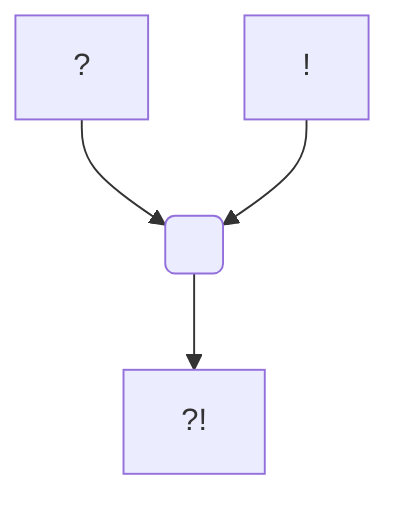

#Personnage/Mortel [[Mortel]]
#CompagnieDuChaos 

# Lossë Lapattë

## Apparence

## Informations personnelles
### Nom Complet
Lossë Lapattë

### Pronoms
### Titres
### Alias
### Type de créature
### Race
Harengon
### Classe %%(le cas échéant)%%
Echo Knight
### Alignement
Chaotique Neutre
### Status
Vivant pour l'instant
### Naissance
Une fois
### Décès
Plusieurs fois
### Résidence
WhiteFord, la montagne et les terres du nord.
### Occupations
Bricoleurs du dimanche, il adore imaginer des plans d'objets extravagant, s'occuper des loups de givres, et préparer son équipement.

## Histoire

### Enfance

Pendant mon enfance, je vivais dans les forêts féeriques. je menais une vie paisible et heureuse, entourée de ma famille et des créatures de la forêt. Nous jouions toujours ensemble avec ma meilleure amie Isilmë, même si je l'appelais Isil (isilmë signifiant clair de lune) à explorer la forêt au gré des vents et des êtres magiques. C’était une harengon magnifique de mon âge au pelage argenté et gris rappelant un clair de lune, un peu espiègle, mais surtout avec un grand sourire, et nous étions toujours fourré ensemble, souvent pour faire des bêtises et des blagues aux habitants de la forêt. Tous y passaient, les fées, les dryades, les satyres et autres… Nous voulions ne jamais être séparés l’un de l’autre. Et un jour, en fin d'après-midi, nous avons trouvé d'anciennes ruines avec un bassin aux reflets magnifiques, entourés de représentations de clair de lune. Nous avons pu observer à travers ce miroir d’eau, de magnifiques paysages blancs et sauvages, mais ces derniers restaient flous. Le soir, en rentrant, nous avons aperçu des lumières rouges dansantes, en arrivant nous vîmes notre village en flamme. Nos amis, nos familles, certains étaient attachés avec de grandes chaînes tandis que d’autres étaient massacrés. De grandes silhouettes, bipèdes reflétant les flammes, brillant de par ces dernières sont responsables de ce cataclysme. Mais, alors que nous étions cachés, une de ces armures rutilantes nous a repérés, et nous nous sommes enfuis. En courant nous sommes tombés sur une pente, et je me suis blessé à la cheville. Isil m’aida alors à marcher, et alors que les bruits de nos poursuivants se rapprochaient, j'aperçus une lumière qui m’attira vers un chemin. En suivant ce dernier, nous nous retrouvâmes devant les ruines et devant cette magnifique fontaine. Mais l’eau était devenue nette, comme si une autre réalité était présente derrière cette surface. En plongeant la main, je sentis la neige sous mes doigts. Je dis à Isil de plonger avec moi, mais elle a refusé, disant qu’ils allaient nous retrouver. Alors elle me poussa dans la fontaine et courut pour attirer leurs attentions ailleurs. Je me suis retrouvé la tête dans la neige et aucun portail derrière moi. Elle m’a sauvé la vie et je ne l’ai plus jamais revu. 
J’ai ensuite erré, traînant une patte engourdie dans la neige, jusqu’au moment où j'aperçu une silhouette. Je me suis mis en position de défense mais le froid, la douleur et la fatigue ont eu raison de moi et je me suis évanouie.

### Sauvetage

A mon réveil, j’étais sous des couvertures, dans une tente et  une étrange créature de petite taille m’observait. Il appela ensuite à travers la tente, et deux silhouettes apparurent. Un grand personnage, musculeux au regard vif, incisif et calculateur, et un être plutôt âgé, au regard plus posé, mais plein de malice. Ce dernier s’approcha de moi, j’ai essayé de me lever pour m’éloigner, mais le grand personnage posa une main ferme sur mon torse et me cloua au lit, avec une rapidité surprenante pour sa taille. Mais malgré cela je ne sentais aucune douleur due à sa prise, mais une violente douleur à la patte. Le vieux monsieur s’approcha de ma jambe, de la lumière apparut entre ses mains, et je sentis une douce chaleur se propager dans ma jambe. Puis la douleur a disparu. Ils parlèrent mais aucun de leurs mots de n’étaient compréhensible, puis voyant que je ne comprenais pas, le grand personnage parla dans plusieurs langue, et à un moment me demanda si je comprenais, voyant ma réaction, il comprit que je parlais le sylvain. Il me demanda sèchement mon nom et je compris que rien ne servait de mentir, il le saurait sur l’instant. Je lui donna mon nom, Lossë Lapattë. Dans son regard, je vis un intérêt, il appréciait quelque part mon comportement de battant. Il m’emmena faire un tour du camp, où il m’expliqua où j’étais, et ce qu’ils étaient. J’étais au sein d’une unité de mercenaire, les Chill, une unité composée d’orcs, d’hobgoblines et de gobelins. Nous étions dans le Nord d’un continent que je ne connaissais pas, en terre WhiteFordienne. Les Chills, malgré leurs apparences, entretenaient de bonnes relations avec les villes et autres communautés. Ils se vendaient régulièrement pour combattre des dangers ou parfois même des envahisseurs. Notre chef, Ardenor Crush, était un ancien humain qui fut réincarné dans un corps de Hobgoblin par son ami magicien, Grangor. L’humain qui m’avait soigné dans la tente. Je lui expliqua ce qui s’était passé, les braconniers, le portail, Isil… Sur le chemin, il m’expliqua que pour survivre ici, il faudrait que je sois un battant, et que je subisse un entraînement sévère, mais juste. Il ne fut pas surpris en voyant mon regard déterminé, prêt à tout pour la vengeance, et il l’accepta, comme s’il savait exactement ce que je ressentais. 

### Entrainement

Tous les jours, je subis un entraînement physique intense, allant jusqu’à me blesser et à m'épuiser. Et tous les jours je suivais des cours particuliers pour apprendre le commun, la langue et les codes de l'unité auprès de Grangor. Grangor essayait aussi de m’apprendre la magie, mais j’avais beau comprendre la théorie, je n’arrivais pas vraiment à réaliser des sorts. J’observais des courants de magie, mais n’arrivait pas à leurs donner une consistance.
Tous les matins, un orc du nom de Gadkhar me tirait du lit sans concession, me faisait faire des tours du campements, des pompes, abdos, soulever des sacs etc… puis il me jetait une arme, en bois au début, généralement la plus proche de sa main, et de m’attaquer avec la sienne. Au début je finissais rossé de ces coups, puis apprit vite à me protéger, et ensuite à riposter. J’appris à me servir de quasiment toutes les armes martiales, de la lame à la garde, dans toutes sortes de situations.
J’allais régulièrement aider dans les différentes unités, pour découvrir des spécialités, et comprendre comment fonctionnait les unités. J’adorais aider à nourrir les loups de givre, avec un gobelin du nom de Gadtraug, très tendre envers ces montures, beaucoup moins envers les autres gobelins qui les montaient. Je pense qu’il préférait quand la monture revenait sans cavaliers, plutôt que l’inverse. Il montait une femelle alpha, magnifique, et j’étais un des rares qui pouvait l’approcher sans y perdre une main. 
Je passais aussi du temps avec un autre gobelin, un peu fou, mais très sympathique, notre ingénieur, Argnieur. Il adorait s’amuser avec la poudre noir et imaginer différents objets, tous les plus incroyables les uns que les autres. Je me souviens d’une petite araignée mécanique qu’il m’avait donnée pour me servir de réveil et ainsi anticiper l'arrivée de Gadkhar dans ma tente.
Régulièrement, nous allions dans des villages et villes Whitefordiennes, pour nous ravitailler, prendre des missions, et passer du bon temps. Je me suis toujours sentis bien accueilli. En même temps nous venions pour les débarrasser de leurs problèmes. J’y ai rencontré des gens surprenants, des explorateurs, des forgerons, des lettrés, jusqu’au simple paysan. Régulièrement Ardenor me disait que nous nous battions pour l’or, mais que nous nous battions aussi pour ces gens-là, car même si le clan était ma famille, en rejoignant le clan je rejoignais aussi Whiteford, ces paysages et ces communautés. J’adorais venir manger de l’aracocré de l’auberge du gobelin malicieux, je me régalais, un vrai plaisir que de pouvoir profiter de ce moments et de rencontrer de nouvelles têtes pleines de nouvelles histoires. 

### L’épreuve

Un jour, je fus en âge de combattre mon premier ennemi. Un groupe de bandit menaçait une voie commerciale importante, les Chills furent payés pour les éliminer. Et ces bandits ont été assez fous pour essayer d’attaquer notre convoi. Ils capturèrent néanmoins un bandit, un humain, semblable à tant d'autres à mes yeux. Puis ils formèrent un cercle de combat, et j’entendis Ardenor, de sa voix puissante, “Humain, tu vas combattre un des nôtres, si tu remportes ce combat tu auras la vie sauve et nous te laisserons en vie avec des provisions. Quant à toi Lossë, tu vas devoir le combattre, car tu es prêt, et si tu n’arrive pas à survivre face à cet être, tu n’arriveras jamais à accomplir ta vengeance !”

On me fournit mes armes, une épée longue, ainsi qu’une hachette. Je fendit l’air avec mes armes, pour m’habituer à leurs poids, puis je me mit en position, prêt à affronter mon adversaire. Ce dernier m’attaqua directement et nous partions dans un échange violent mais précis. Je préparais chaque coup et anticipais les siens, mais il réussit à me surprendre et porta plusieurs estafilades. Je commençais à faiblir, et lorsque je commençais à reculer, repoussé dans mes retranchements, je ressentis comme des sensations, de déjà vu, comme si j’étais à deux endroits à la fois. Perturbé par ces nouvelles sensations, il trouva une opportunité et réussit à me renverser. Allongé sur le dos, les armes en main, je me laissa guider par ces nouvelles sensations. Au moment où il allait me frapper, je me retrouva derrière lui, sur mes pieds, les armes en main, tandis que son épée venait frapper violemment le sol ou j’étais l’instant d’avant. Nous étions tous les deux surpris, mais l’opportunité était trop grande. Je passa le fil de ma lame le long de ces jambes pour le faire tomber. Je le désarma, je me retrouva, mes armes au-dessus de sa gorge, en attente. J’entendis l’ordre d’Ardenor, puis acheva mon adversaire. C’était notre contrat, c’était ma première vie, mais c’était mon devoir. Je l’acheva le plus rapidement possible, avec la moindre douleur. Ardenor le remarqua, me fit un signe approbateur, des applaudissements et des cris scandaient mon nom, puis l’arène de combat fut nettoyée. Je le rejoignis, et il me dit : “Tu as pris une vie aujourd’hui, mais c’est notre métier. Je te félicite d’être encore en vie, je savais que tu avais du potentiel le jour où nous t’avons trouvé. Ce soir la cérémonie aura lieu. Tu recevras notre marque, et à jamais tu feras partie des nôtres. Dès demain, tu n’accompagneras dans nos missions" Le soir, la cérémonie eu lieu, je recevis ma première armure, le tatouage, un poing entouré d’un nuage blanc, de mes premières armes personnels, et de mon tabar. L’on but, l’on rit, et je m’endormis paisiblement, j’avais retrouvé vraiment une famille.

### Choc

Un jour, Ardenor a accepté une mission de libération, d’une petite ville whitefordienne que nous connaissions, financée par un mouvement de résistance. Mais en arrivant nous avons vu la ville en flamme. Les gens, si généreux avec moins étaient pendus, empalés… Et lorsque je vis les visages d’enfants, de l’aubergiste, de la boulangère, que je reconnus avec peine, de nos anciens passages, mon sang ne fit qu’un tour. Nous avons massacré sans états d'âme, l’arrière garde qui continuait leurs exactions sur la population. Surpris la par notre intervention, la bataille fut rapide. Nous avons enterré les corps des villageois, recueilli les rares survivants, et empalé les têtes de tous les soldats kingfordiens. Ils paieront pour ce qu’ils ont fait. Temps des haches, temps des épées, les boucliers sont fendus, temps des tempêtes, temps des loups, avant que le monde s’effondre, Whiteford n'épargnera pas Kingford. Le pardon appartient aux dieux, mais les envoyer auprès d’eux dépend de moi.

### Le départ

Un jour après des années de missions, le chef m’appela dans sa tente. “Aujourd’hui, tu es prêt pour partir chercher tes ennemis. J’ai trouvé des informations concernant une île où la frontière entre les mondes serait affaiblie. La récompense de notre dernière mission est pour toi. Tout le clan est d’accord. Maintenant part, mais n’oublie pas que tu seras toujours un membre des Chills, et que tu pourras toujours revenir à la maison. Nous, nous allons nous préparer, il paraît que le roi serait de retour pour libérer Whiteford. Et tu sais que nous n’apprécions guère les Kinfordiens.” 

Je préparais mes affaires, et je partis sans me retourner, le cœur lourd, mais ma vengeance s’approchait à grand pas. Arrivé à la ville la plus proche, je trouvai des informations sur la route que je devrais parcourir, et trouva du travail en tant que mercenaire pour protéger des caravanes. 

## Description
### Apparence
C'est un Harengon relativement grand pour son espèce. D'un pellage blanc immaculé, il a une posture fière, un oeil vif, et une musculature discrète sous son pellage. Il porte un tatouage de son unité sur le haut du bras droit, un poing entouré d'un nimbe blanc. 

### Personnalité

## Capacités

## Relations
The Chill. Quelques connaissances faites lors de ces voyages à la recherche de la vengeance. 
### Famille
Ma famille a disparu, probablement morte. Les membres des Chill.
### Relations amoureuses 
### Amis
### Alliés et Affiliations
The Chill, Whiteford
### Ennemis
Bloodaxe, Blue Sigil et l'empire KingFordien
### Autres relations

## Arbre Généalogique

## Citations

## Galerie

## Anecdotes
