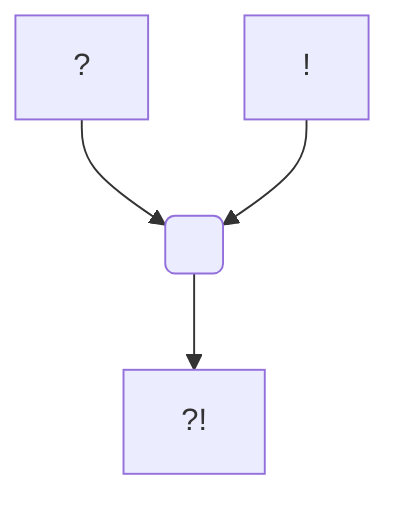

#Divinité/Panthéon-Universel [[Panthéon Universel]] 

# Dithos

## Informations personnelles
### Nom Complet
### Pronoms
### Titres
### Alias
Le Maître du Jeu
Le Vagabond (Surnom en Commun)
Laethrandir, littéralement "Le Vagabond Perdu" (Surnom en Elfique)

### Type de créature
### Race
### Classe %%(le cas échéant)%%
### Alignement
True Neutral
### Status
### Naissance
### Décès
### Résidence
### Occupation
Dieu du Destin

## Histoire

## Description
### Apparence

### Personnalité

## Capacités

## Relations
### Famille
### Relations amoureuses
### Amis
### Alliés et Affiliations
### Ennemis
### Autres relations

## Arbre Généalogique

## Citations

## Galerie

![[Forme Mortelle.png]]

## Anecdotes

Il a un jour vu des pirates aborder un navire et, depuis, porte un tricorne. Pourquoi ? Parce que les tricornes, **c'est cool** !
Ses offrandes préférées sont le pop-corn et le chocolat chaud à la vanille.
