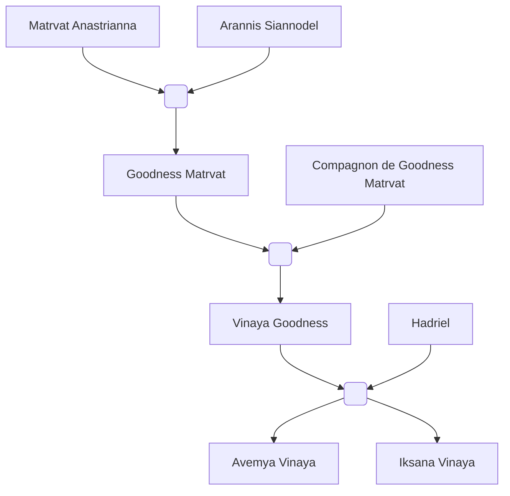

#Personnage/Mortel 

# Arannis Siannodel

## Apparence

## Informations personnelles

### Nom Complet
Arannis Siannodel
### Pronoms
Il/ Masculin
### Titres
Maître conférencier en arcane
### Alias
Mindartis Amakiir (officiellement à Whiteford)
### Type de créature
Humanoïde
### Race
Elfe du Soleil
### Classe
Niv 14 Magicien école de l'Illusion
### Alignement
Neutre Bon
### Status
Vivant

### Naissance
66 de l'ère Kinford

### Résidence
[[Kethlone]] (Anciennement)
Amangassuaq, [[Whitford]]

### Occupations
Professeur et Académicien (Anciennement)

## Histoire

Arannis Siannodel était encore un jeune elfe, vivant paisiblement dans la cité de Maentheas.
Sa famille faisait partie de la haute sphère de la société. 
Il venait d'entrer à l'académie en tant qu'étudiant en arcane, sa famille l'avait obligé pour préserver la vraie nature de cet art. 
Il était hors de question de perdre les traditions si importantes à cause d'un vol hérétique de la part des humains !

À son jeune âge, il ne comprenait pas le scandale que lui rabachait ses parents.  Il voyait justement comme une opportunité de partage de culture. 
Puis il a entendu parler de la guerre et ainsi naquit une haine des kinfordiens.
Comment pouvait-il ruiner ce si bel art en faisant une tel atrocité ?

Par chance, pendant ses études, il rencontra une autre elfe du soleil qui semblait d'accord avec lui. Elle répondait au doux nom de Matrvat.
Bien qu'ils avaient une conception de la magie radicalement différente, les deux s'entendaient à merveille.
Pour Arannis, il s'agissait de l'amour fou. Il ne pensait qu'à elle, rêvait d'elle, sa détermination et sa discipline était des plus admirable pour le jeune elfe. 
Il lui chantait des sérénades, la charmait avec sa maîtrise des illusions, 
il lui en faisait voir de toutes les couleurs (littéralement).

Et Matrvat succomba à son charme. Leur amour était si fort que rien ne pouvait les séparer.

Ils passèrent leur diplôme, mais Arannis décida de poursuivre ses études pour devenir docteur, puis plus tard maître conférencier pour enseigner à son tour l'arcane.

Suite à cela, le couple décida d'emménager à Kethlone, enfin Arannis suivit sa chère et tendre, il avait même prévu le coup en ayant la possibilité de se téléporter à l'académie et de rentrer à la maison tout aussi facilement.

Ainsi pendant quelques siècles les deux amoureux vivaient d'amour et d'eau fraîche. Tout allait si bien dans leur ville recluse.
Ils décidèrent d'avoir un enfant, et ils avaient hâte de rencontrer ce nouveau membre de la famille.

Quatre siècles s'étaient écoulés depuis leur rencontre.
Matrvat était enceinte et allait bientôt accoucher, Arannis avait décidé de prendre des vacances pour s'occuper de sa femme.
L'engouement ne faisait que croître et cette envie d'être à trois les dévorait presque de l'intérieur.
Ils ne pensaient qu'à leur bébé, ils avaient pris des cours d'éducations pour être sûrs que leur enfant serait excellent dans tous les domaines académiques.

Mais hélas le destin en avait décidé autrement.

Un ancien dragon rouge vola au dessus de la ville.
Puis deux, une dizaine, une vingtaine !
Une armée entière d'anciens dragons rouges se mirent à foncer vers cette pauvre ville de Kethlone pour la réduire en cendres !
Un spectacle insensé.
Les questions se bousculèrent à la vitesse de la lumière dans la tête du couple qui fut paralysé par la peur, comme enchaînés, ils ne pouvaient même pas fuir.

En un battement de l'œil, la ville si coloré d'arbres, d'herbes, de lumière et de nature fut transformé en un enfer terrestre.
Quelqu'un devait les contrôler, un tel évènement était impossible naturellement !

Matrvat, sous le stress, perdit les eaux et dû accoucher sur le moment avec une vue des plus horrifiques.
Les nouveaux parents ne pouvaient profiter de ce qui devait être le plus beau jour de leur vie, les flammes s'emparaient de leur fille.
Cette enfant, encore si fragile, pleurait, criait de douleur, sa chair commençait à fondre et l'odeur du charbon et du sang carbonisé se mêlait à l'air.

Matrvat, dorénavant à genoux, pleurait et refusait de bouger, serrant son enfant dans ce qu'elle pensait être une dernière embrassade.
Arannis lui, fut enragé par la scène, il ne pouvait laisser voir sa progéniture se faire dévorer par les flammes. Il fouilla dans la maison bouffée par les flammes un grimoire, un parchemin, n'importe quoi de magique qui pourrait être utile.

Et heureusement il trouva un grimoire. Par chance, il avait décidé d'étudier la magie divine récemment et l'avait pris à la bibliothèque.
Il était étrangement en bon état malgré les flammes qui le couvrait.
Ni une ni deux, il le prit, l’amena à sa femme avant de l’ouvrir. Cette dernière fut dans un premier temps terrifiée, connaissant les secrets de ce grimoire, mais comprenant qu’elle n’avait pas d’autres choix si elle voulait sauver la vie de leur fille, elle hocha la tête.

Les deux ouvrirent le grimoire et tombèrent sur une page qui les interpella :
*"Rituel de renaissance à travers les flammes."*

Ils le firent sans hésiter, utilisant les cendres de leurs anciens voisins, de leurs anciens compagnons, du sang caraméliser pour dessiner le cercle, et des cadavres.

Ils chantèrent en ce qui semblait être pour eux de l'abyssal, plaçant leur enfant dans une terrible condition au centre du cercle.
Leur voix résonnèrent à travers les murs maintenant effondrés de la plaine. Les vrombissements de leur incantation faisait même trembler le sol, l'amour et le chagrin d'un couple prêt à tout déployait une force arcanique incommensurable.

Les flammes se mirent à tournoyer autour du cercle, autour du couple mains jointes, et prirent toutes les couleurs imaginables.
Peu importe où les parents posaient leurs yeux, des flammes bleues, vertes, oranges, rouges et même blanches les entouraient.

Ar’athar, maître des flammes apparut dans cette tornade de flammes.

*“Vous qui m’avez invoqué, qu’osez-vous demander ?”*

Les deux parents furent d’abord muet, la présence divine les intimidait tellement.
Mais Arannis, emporté par une passion protectrice, brisa le silence d'un air déterminé, son regard faisait face à celui de la divinité.

Il expliqua que le couple voulait sauver leur fille de cette apocalypse dont ils étaient victimes, ainsi que punir la source de ce malheur.

Ar'Athar soupira et les regarda, bien que leur intention soit des plus nobles, il se devait de les prévenir :

*"Votre lignée sera maudite pour toujours, vos enfants seront forcés de plonger leur proches dans des évènements plus que malheureux, de subir des épreuves des plus rudes tel qu'une vie paisible devra être amplement mérité pour y accéder.*
*Mais en échange, le feu se montrera comme allié, ils auront une affinités accrue à la magie et auront tout pour être des légendes.*
*Grâce à cette offrande, ce n'est pas un pacte que je vous offre, mais un contrat. Seul votre fille devra m'aider en échange de cette fraction de pouvoir divin."*

Bien évidemment, ils acceptèrent. Ils étaient prêt à tout pour sauver leur fille.

Le marché avait été conclu, Ar'athar claqua des doigts et se mit à changer. Sa respiration devint stable, elle avait l'air paisible, ses brûlures disparurent, mais sa peau changea pour prendre une couleur rouge-violacé.
Des cornes se mirent à pousser sur le crâne et une queue continua sa colonne vertébrale, ses pupilles disparurent pour laisser juste une sclère rouge-orangé.

Ar'athar disparut et avec lui les flammes et les cendres de la ville.

Les parents étaient soulagés de voir leur fille saine et sauve et prirent leur enfant maintenant tieffeline dans leur bras.

"Elle s'appellera Bonté, Bonté Matrvat pour qu'elle soit connus pour sa bienveillance et le bien qu'elle répandra."

Suite à cet incident, il était impensable pour la fille de rester sur ces terres.
Entre le fait d'avoir une famille infernal et le risque qui grouillait maintenant, il valait mieux prendre les voiles pour vivre dans une autre ville, tout en camouflant les traits infernaux qu'avait leur fille grâce à la maîtrise de l'illusion qu'avait acquit le père.

## Description
### Apparence
Arannis est un magnifique elfe du soleil à la peau de bronze, une musculature finement sculpté et assez grand avec son 1m83.
Ses cheveux sont châtains, lisses, courts et des tatouages dorées parcourent son visage et son corps.
Il porte des vêtements rouges et des ornements dorés.
### Personnalité
Arannis est un homme humble, mais connaît ses capacités et le fait bien savoir. Il est plutôt joueur, taquin, voir même certains diront qu'il est provocateur.
Mais avant tout il est un amoureux et un passionné, utilisant de tout son charme pour séduire celle qui le fait rêver.
C'est un mari à l'esprit léger, simpliste, mais dévoué dans tout ce qu'il fait. 
## Capacités
Maître de l'illusion.
## Relations
### Famille
[[Matrvat Anastrianna]] (Compagne)
[[Bonté Matrvat]] (Fille)
[[Vinaya Bonté]] (Petite-fille)
[[Avemya Vinaya]] (Arrière-petite-fille)
[[Iksana Vinaya]] (Arrière-petite-fille)

### Alliés et Affiliations
Académie de [[Maentheas]] (Anciennement)

### Ennemis
[[Raghor Onyx]]

## Arbre Généalogique

## Citations
*"Vous qui êtes le maître des flammes, il en est de votre responsabilité de sauver cette âme innocente n'ayant fait pour mériter un tel supplice !"*
## Galerie

## Anecdotes
L'illusion qu'il adore faire à sa famille est une aurole boréale de milles couleures.