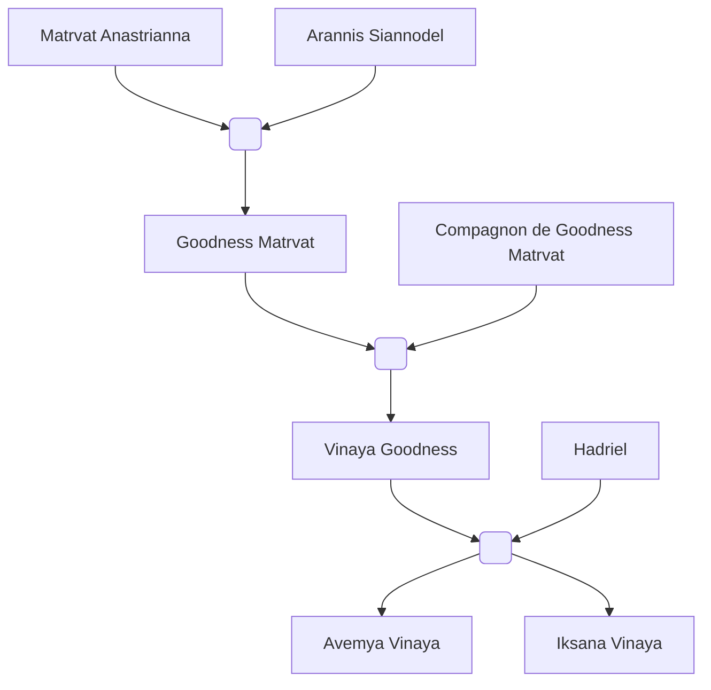

#Personnage/Mortel 

# Arannis Siannodel

## Apparence

## Informations personnelles

### Nom Complet
Arannis Siannodel

### Pronoms
### Titres
### Alias
### Type de créature
### Race
### Classe %%(le cas échéant)%%
### Alignement

### Status
Vivant ?

### Naissance
?

### Décès
?

### Résidence
[[Whitford]] ?

### Occupations
Professeur et Académicien (Anciennement)

## Histoire

Deux elfes du soleil s’aimant du plus haut point, depuis qu’ils étaient âgés qu’une simple cinquantaine années. Ils avaient des bases de magies mais hélas rien d’exceptionnels, deux magiciens des plus communs, dans la moyenne. Bien qu’ils étaient en quelque sorte bénis grâce à leur don et aisance magique, ils n’avaient pas les prédispositions nécessaires pour être des légendes. Enfin…ce n’est pas comme si ça les intéressait réellement.

Après tout, lorsqu'une vie est aussi longue que celle d’un elfe, on a tout le temps nécessaire pour avoir une vie paisible n’est-ce pas ?

Hélas ce n’est pas ce que les dieux avaient décidé de leur réserver.  

Les conflits étaient une chose commune, bien que mineure, au Nord, que ce soit une tribu souhaitant élargir son territoire, ou bien une micro-guerre civile à cause de la pénurie de vivres, les terres se nourrissaient du sang versé par la violence de la vie bien que peu en soit fatal pour quiconque.
Le couple avait maintenant 4 siècles, et Matrvat était enceinte d’une fille. Son accouchement allait arriver d’un jour à l’autre. Les parents avaient si hâte de rencontrer leur bien-aimée.
Mais rien n’aurait pu préparer le couple astral à la peine qui allait leur tomber dessus.

Un, puis deux, une dizaine, une vingtaine,  une armée entière d'anciens dragons rouges se mirent à foncer vers la pauvre ville de [[Kethlone]]. Un spectacle insensé. Tant de questions se posaient dans la tête du couple mais hélas pas assez de temps pour réfléchir à quoi que ce soit, un simple clignement des yeux avait suffit pour voir la ville se transformer en enfer terrestre.
Impossible, quelqu’un devait être responsable de ce phénomène !

Matrvat perdit les eaux à cause du stress, et dû accoucher dès qu’elle vu cette image horrifique.

Les nouveaux parents ne pouvaient profiter de l’évènement, de la joie qui était censée être le plus beau jour de leur vie.
La chair qui fondait, les cris de douleurs, l’odeur du charbon, l’horreur de la mort qui empestait les lieux qui étaient autrefois remplis de souvenirs, de vie, d’amitié était maintenant en cendre.
Arannis était figé par l’enfer, Matrvat par la peur.

Le jeune bébé fut hélas pris dans une bouffée de flammes. Arannis, révolté par ce moment, ne pouvait se laisser voir sa progéniture brûlée ainsi. Il fouilla dans ce qui restait de la maison, partout où il pouvait, voir si un grimoire, un parchemin, n’importe quoi de magique restait.
Et il trouva un grimoire. Un grimoire étrangement en bon état malgré les flammes qui l’entouraient. Ni une ni deux, il le prit, l’amena à sa femme avant de l’ouvrir. Cette dernière fut dans un premier temps terrifiée, connaissant les secrets de ce grimoire, mais comprenant qu’elle n’avait pas d’autres choix si elle voulait sauver la vie de leur fille, elle hocha la tête.
 
Les deux ouvrirent le grimoire, et une page les interpella.
“Rituel de renaissance à travers les flammes.”

Ils le firent sans hésiter, utilisant les cendres de leurs anciens compagnons, du sang caramélisé pour dessiner le cercle, et des cadavres.

Ils chantèrent ce qui semblait être en abyssal, plaçant leur enfant dans une terrible condition au centre du cercle.

Leur voix résonnèrent  à travers les parois, les vrombissements de leur grave en faisait même trembler le sol, le regard amoureux et rempli de chagrin unissait le couple en ce moment.
 
Les flammes se mirent à tournoyer autour du cercle, autour du couple, peu importe où ils regardaient, ils ne voyaient que des flammes bleues, vertes, oranges, rouges, et même blanches.

Ar’athar, maître des flammes apparut dans cette tornade de flammes.
“Vous qui m’avez invoqué, qu’osez-vous demander ?”
Les deux parents furent d’abord muet, la présence divine les intimidait tellement.

 Annaris brisa le silence, expliquant qu’ils voulaient sauver leur fille de cette apocalypse qu’ils ont dû subir, et punir la source de ce malheur.
Ar’athar les regarda, et bien que leur intention soit des plus nobles, il se devait de les prévenir:
“Votre lignée sera maudite pour toujours, vos enfants seront forcés de plonger leurs proches dans des événements plus que malheureux, de subir des épreuves des plus rudes, telle qu’une vie paisible devra être amplement mérité pour y accéder.
Mais en échange, le feu se montrera comme allié, ils auront une affinités à la magie accrue.
Ils auront tout pour être des légendes.
Ce n’est pas un pacte d’occultiste qui me lie à vous, et ceux grâce à vos offrandes, mais votre fille devra m’aider en échange.”

Ils acceptèrent. Si ça pouvait sauver leur fille, ils seraient prêts à tout.

Le marché avait été conclu, Ar’athar claqua des doigts et la jeune enfant se mit à changer.
Sa respiration devint stable, elle avait un air paisible, ses brûlures disparu, mais sa peau changea pour prendre une couleur rouge-violacé.
Des cornes se mirent à pousser sur le crâne, et une queue continua sa colonne vertébrale, ses pupilles disparut pour laisser juste une sclère rouge-orangé.

Ar’athar disparut, et avec lui les flammes et les cendres de la ville.

Les parents étaient soulagés, et prirent leur fille maintenant tieffeline dans leurs bras.
“Elle s’appellera Goodness, Goodness Matrvat, pour qu’elle soit connus pour sa bonté et le bien qu’elle répandra.”

La famille prit les voiles, pour vivre dans une autre ville, les parents utilisaient un sort de changement d’apparence pour protéger leur fille d’être reconnue en tant que démon en cas de besoin.

## Apparence

## Personnalité

## Capacités

## Relations
### Famille
[[Matrvat Anastrianna]] (Compagne)
[[Goodness Matrvat]] (Fille)
[[Vinaya Goodness]] (Petite-fille)
[[Avemya Vinaya]] (Arrière-petite-fille)
[[Iksana Vinaya]] (Arrière-petite-fille)

### Alliés et Affiliations
Académie de [[Maentheas]] (Anciennement)

### Ennemis

## Arbre Généalogique

## Citations

## Galerie

## Anecdotes