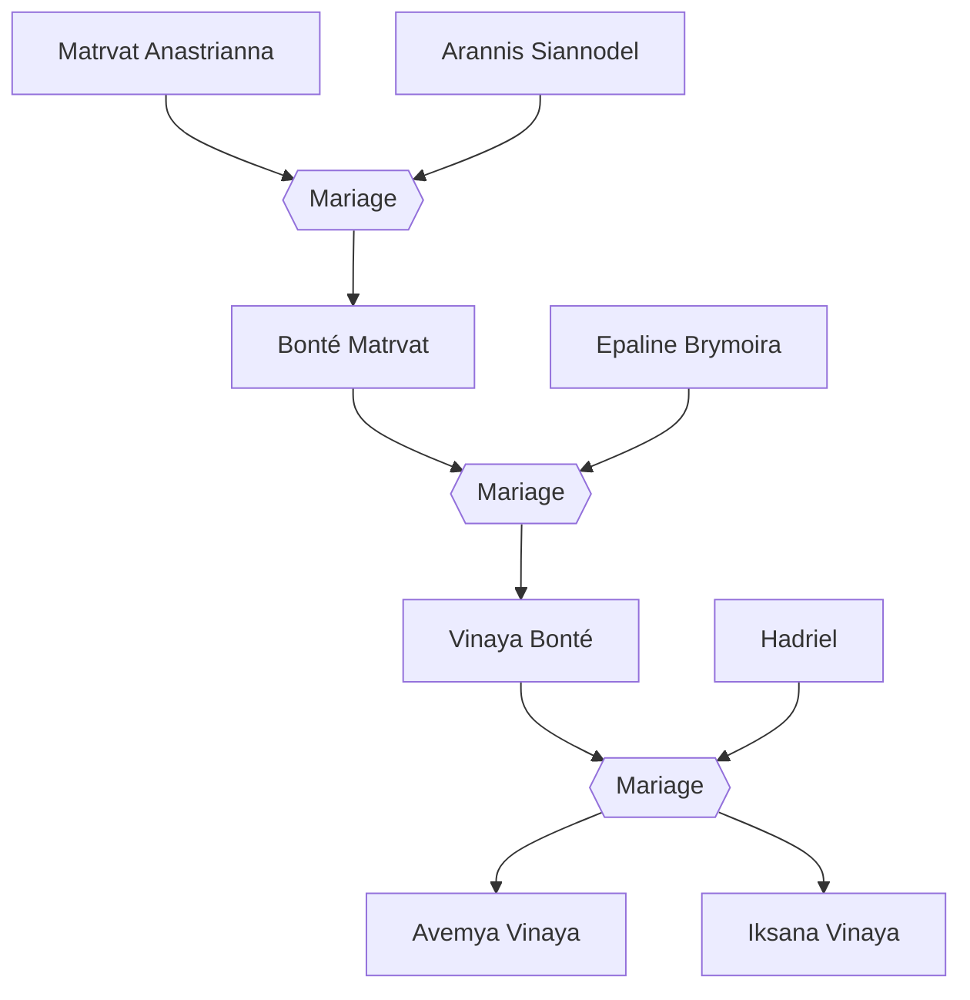

#Personnage/Mortel 

# Avemya Vinaya

## Apparence

## Informations personnelles
### Nom Complet
Avemya Vinaya
### Pronoms
Elle / Féminin
### Titres
### Alias
Tornade de sang et de feu (oui on la confond énormément avec sa grand-mère)
### Type de créature
Humanoïde
### Race
Tieffeline
### Classe
Niv 6 (min) Sorcière du brasier éternel
Niv ? Paladin de l'héroïsme
### Alignement
Chaotique Bon
### Status
Vivante
### Naissance
765 de l'ère Kinford

### Résidence
Amanguassuaq
### Occupations
Aventurière

## Histoire
Admiration pour sa grand-mère, devint chevalière.
*insérez péripétie*
Éveil de pouvoir.
Poussez sur la voix du paladin de l'héroïsme.
## Description
### Apparence

### Personnalité

## Relations
### Famille
[[Arannis Siannodel]] (Arrière-grand-père)
[[Matrvat Anastrianna]] (Arrière-grand-mère)
[[Bonté Matrvat]](Grand-mère)
[[Hadriel]] (Père)
[[Vinaya Bonté]] (Mère)
[[Iksana Vinaya]] (Sœur)

### Ennemis
[[Raghor Onyx]]

## Arbre Généalogique

## Citations

## Galerie

## Anecdotes
