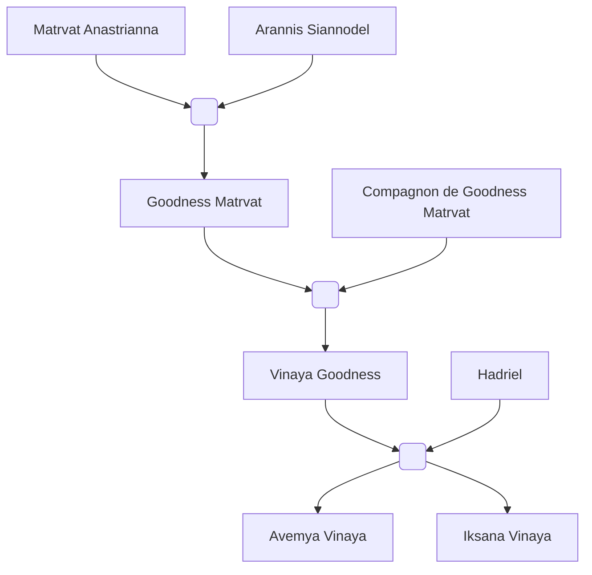

#Personnage/Immortel 

# Avemya Vinaya

## Apparence

## Informations personnelles
### Nom Complet
Avemya Vinaya
### Pronoms
Elle / Féminin
### Titres
Tornade de sang et de feu (oui on la confond énormément avec sa grand-mère)
### Alias
### Type de créature
### Race
### Classe %%(le cas échéant)%%
### Alignement
### Status
### Naissance
765 de l'ère Kinford

### Décès
### Résidence
### Occupations

## Histoire

## Description
### Apparence

### Personnalité

## Capacités

## Relations
### Famille
[[Hadriel]] (Père)
[[Vinaya Bonté]] (Mère)
[[Iksana Vinaya]] (Sœur)
### Relations amoureuses
### Amis
### Alliés et Affiliations
### Ennemis
### Autres relations

## Arbre Généalogique

## Citations

## Galerie

## Anecdotes
