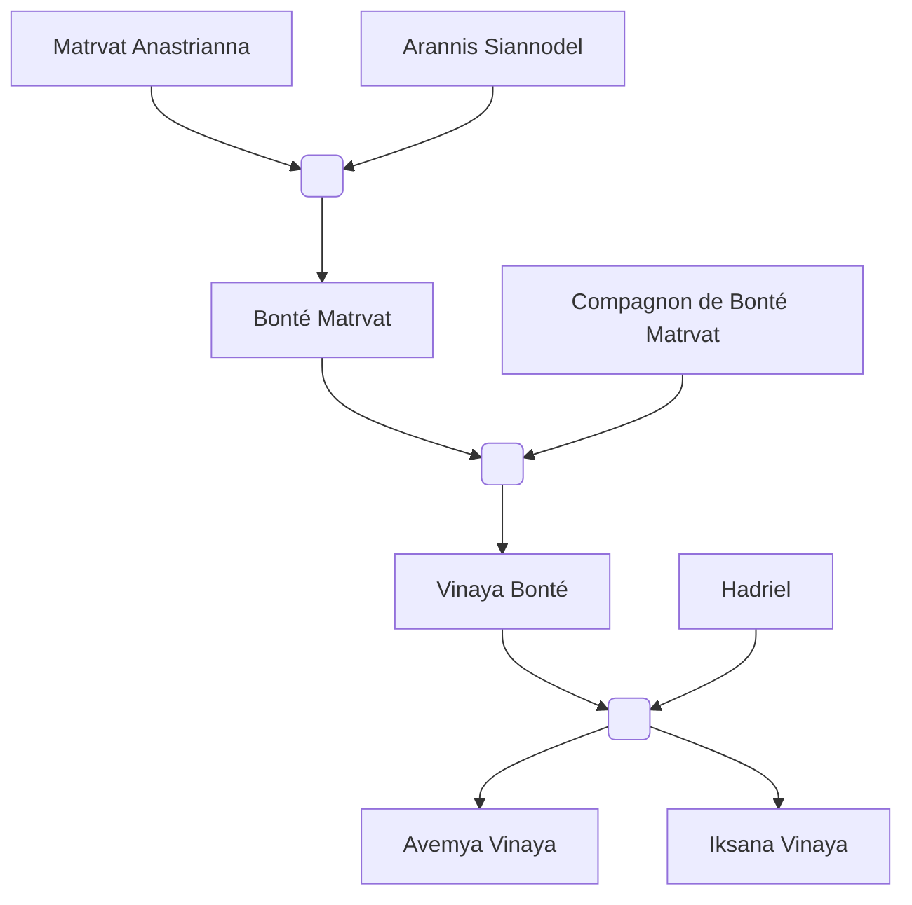

#Personnage/Mortel 

# Bonté Matrvat

## Informations personnelles
### Nom Complet
Bonté Matrvat 
### Pronoms
Elle / Féminin
### Titres
/
### Alias
La tornade de sang et de feu
### Type de créature
Humanoïde
### Race
Tieffeline
### Classe
Niv 14 Sorcière du Brasier éternel
Niv 16 Paladin de l'Héroïsme
### Alignement
Loyal Neutre
### Status
Vivante
### Naissance
503 de l'ère Kinford

### Résidence
Amangassuaq, [[Whitford]]
### Occupations
Garde du roi du [[Royaume Whitfordien]]
## Histoire
Une enfant nacquit.
Alors qu'en temps normal les pleurs d'un nouveau-né est une bonne nouvelle, il s'agissait d'une horrible épreuve pour ce bébé né dans les flammes d'un attentat.

Aussitôt qu'elle nacquit, son corps fut dévoré par les flammes.
Aussitôt née, aussitôt en péril.

Mais un dieu accepta de la sauver, mais la transforma en tieffeline en échange.
Ses parents n'avaient pas d'autres choix s'ils voulaient la sauver.

C'est ainsi que Bonté fut mise au monde.

Alors qu'elle n'était pas en âge de comprendre ce qui lui arrivait, elle se faisait déjà transporter jusqu'aux terres de [[Whitford]], son corps était camouflé à l'aide de nombreux sorts lors de nombreuses occasions.
Pendant plusieurs années, cette famille vagabondèrent à travers les plaines enneigées, jusqu'à finalement trouver refuge à une ville, Amanguassuaq.

Les parents eut la chance de voir que le peuple avait accepté leur fille comme l'une des leurs.
Malgré sa différence plus qu'évidente, la petite tieffeline se faisait de nombreux amis parmi les enfants de la ville.
Elle y peut apprendre la culture de ce qui était à présent son peuple, les parents n'en étaient que des plus ravis.

Bonté avait maintenant 16 ans lorsque ses capacités de sorcière du Brasier Éternel s'étaient réveillés. C'est également à cette période qu'une voix se mit à lui parler directement dans son esprit. Il s'agissait d'Ar'athar, la même divinité qui l'avait sauvé à sa naissance.
Il lui indiqua comment s'entraîner ainsi que la suite du contrat "signer" à sa naissance qu'elle devait respecté. 

C'est lorsqu'elle avait éveiller toutes ses capacités d'ensorceleuse après de nombreuses années à s'entraîner et explorer qu'elle devint une paladine de l'héroïsme.
Elle suivit les instructions de son dieu, parcourant terres et mers, protégeant villes et villages, soignant les blessés, empêchant les guerres civiles et même éliminer les menaces de la nation.

Les missions défilaient, et avec sa réputation n'arrêtait pas de grimper. Chaque menace qui l'attendait finissait par être une réussite de plus sur son tableau.
Chaque bataille qu'elle rejoignit devenait une victoire garantie. Elle était adulée par ses alliés, crainte par ses ennemis.

Pendant l'une de ses nombreuses missions, elle trouva le responsable de l'incendie de Kethlone, celui qui avait mené cette armée de dragon, qui avait bouleversé la vie de ses parents. Il s'agissait d'un nécromancien ayant manipulé l'esprit de tous ces dragons. 
Bien évidemment, Bonté l'affronta dans une longue bataille s'écoulant sur des jours, même des semaines sans s'arrêter.
Mais hélas la conclusion ne fut pas satisfaisante, il s'était enfui avant d'être achevé. Bien qu'elle eut un goût amer dans la bouche, une partie de l'objectif était remplie, et les dragons furent de nouveaux libres dans un état naturel.

Sur le champs de bataille, Bonté fut sauvée par une certaine Epellia, une elfe clerc vouée au même dieu apparemment puisqu'elle aussi recevait les mêmes missions depuis une divinité. Depuis, Bonté s'était jurée de la protéger. Les deux devinrent amies, puis meilleures amies.
Elles voyageaient à présent ensemble et formaient un tandem presque parfait.

À la fin d'une énième mission, le duo passa par une église pour prier. Malheureusement, elles furent prises dans une embuscade tendue par des orcs. Assommées par surprises, elle fut kidnappées et emmener loin de leur lieu de prière.

Quand Bonté se réveilla enfin, elle semblait se trouver dans une base sous terre, fermement retenue prisonnière, attachée par des chaînes de métal, suspendue au mur.

Pendant ce qu'il semblait être des jours, elle fut torturée. Bonté continua malgré tout de prier Ar'athar, gardant la foi auprès de son dieu, espérant que tout aille pour le mieux.

Les orcs la gardaient en vie, ayant eut vent de ses prouesses, ils voulaient la briser pour en faire une arme des plus dévastatrices.

Pour finir cette fracture de l'esprit, les orcs se sont mis à arrêter de torturer Bonté pour à la place s'attaquer à Epellia.
Mais après quelques mois, alors que par miracle, le duo gardait encore espoir, les orcs exécutèrent par la mort la plus lente et douloureuse la tendre elfe.
Alors que le sang remontait dans sa bouche, elle réussit à lâcher quelques paroles décorées d'un sourire des plus tendre et chaleureux :"Ne perds pas espoir, résiste pour nous deux ma légende."

Ce moment fut la goutte de trop pour Bonté. 
L'énergie divine coula intensément dans ses veines alors que ses yeux illuminaient la salle d'une lumière d'un blanc pure.
La haine couplée à l'énergie divine centupla sa force et son agilité. Elle arracha les chaînes des murs, les rendit incandescente, puis brûla, massacra, tortura chaque orc qu'elle pouvait voir.
Bien qu'elle n'était armée que de ses mains et de ces chaînes, elle remplaçait une armée entière.
Il n'y eut pas un seul survivant.

Bonté sortit de la base, encore recouverte de sang et de son manteau de flammes et ainsi naquit "la tornade de sang et de feu".
À présent, son nom n'avait aucune importance, le monde savait que dès lors qu'ils voyaient une femme au manteau de flamme aux yeux oranges, ils subiraient la fureur d'une divinité.

Après un siècle entier de missions, de batailles et de victoires, Bonté fut relevé de ses fonctions et put entamer cette vie paisible qu'elle attendait.

Bonté commença ainsi une nouvelle vie, son identité, qui inspirait terreur chez l'ennemi et espoir chez l'allié, résonna encore dans les plaines.
Elle trouva un compagnon qui l'accepta pour qui elle était. Avec lui, elle fonda une famille.
Bonté décida de garder la même méthode de nom que sa mère, l'idée qu'une famille puisse prospérer sans être impacté par les actes d'un parent et permettre à la progéniture de ne pas subir la pression d'être comparée sans cesse à un ancêtre lui plaisait.

C'est ainsi qu'elle nomma sa fille, Vinaya Bonté.

Hélas, quelques dizaines d'années après la naissance, le mari décéda tragiquement pendant une des nombreuses batailles.
Cet incident poussa Bonté à reprendre les armes et reprendre son serment pour le roi.
## Description
### Apparence
Bonté est une grande tieffeline et large par sa musculature des plus impressionnantes.
Elle a des cheveux noires, une peau violette, des yeux oranges sans sclère ni pupilles, des cornes qui se touchent à environ 15 cm au dessus de son crâne, formant presque une auréole.
Elle a également une grande tâche de naissance s'enroulant sur tout son corps depuis son front aux motifs de flammes rouges comme une banderole.
Elle possède plusieurs ornements en or, un qui décore complètement son oreille, plusieurs chaines décorant ses cornes, et un à la pointe de sa queue.

### Personnalité
Bonté est bien plus stricte que sa mère, bien plus sérieuse et moins expressive.
Elle est devenue distante émotionnellement à cause de toutes les guerres, et sa rage de vivre se fait clairement sentir.
Malgré toute la froideur dont elle fait souvent preuve, elle reste une mère aimante qui fait tout pour soutenir sa descendance... à sa façon.

## Capacités
Considérée comme une demi-déesse à cause de ses compétences aux combats exceptionnels ?
## Relations
### Famille
[[Matrvat Anastrianna]] (Mère)
[[Arannis Siannodel]] (Père)
Compagnon non-nommé
[[Vinaya Bonté]] (Fille)
[[Avemya Vinaya]] (Petite-fille)
[[Iksana Vinaya]] (Petite-fille)

### Relations amoureuses
### Amis
### Alliés et Affiliations
[[Whitford]]
L'armée de Whitford
Le roi de Whitford
### Ennemis
[[Raghor Onyx]]

## Arbre Généalogique

## Citations

## Galerie

## Anecdotes
