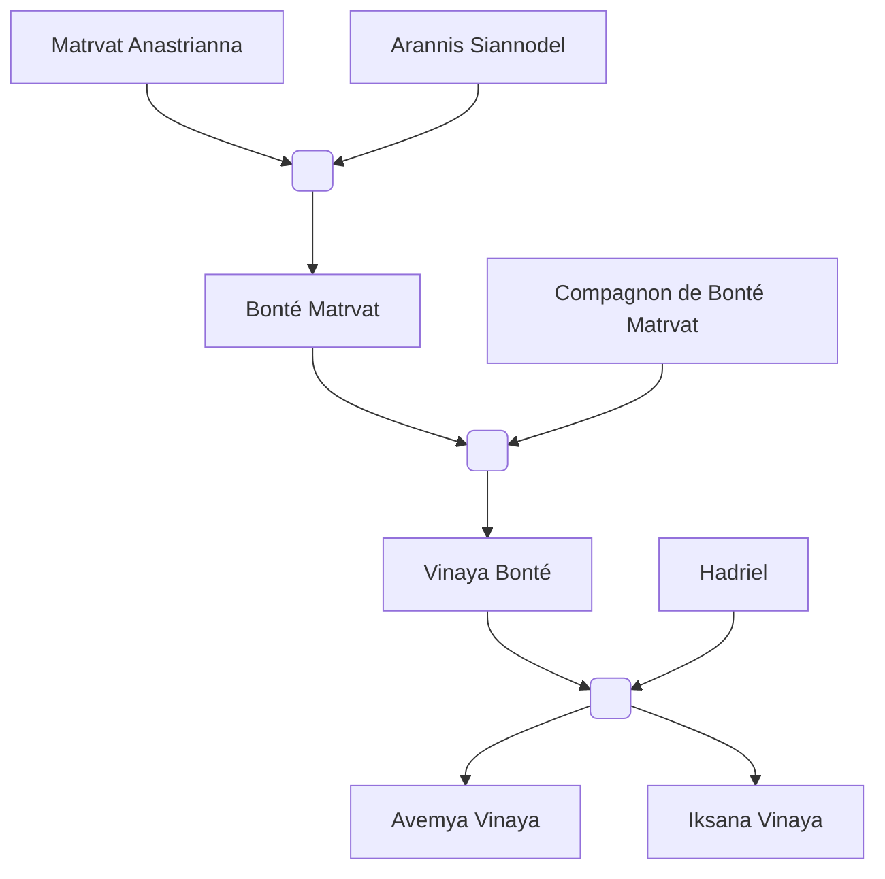

#Personnage/Mortel 

# Bonté Matrvat

## Informations personnelles
### Nom Complet
Bonté Matrvat 
### Pronoms
Elle / Féminin
### Titres
/
### Alias
La tornade de sang et de feu
### Type de créature
Humanoïde
### Race
Tieffeline
### Classe
Niv 14 Sorcière du Brasier éternel
Niv 16 Paladin de l'Héroïsme
### Alignement
Loyal Neutre
### Status
Vivante
### Naissance
503 de l'ère Kinford

### Résidence
Amangassuaq, [[Whitford]]
### Occupations
Garde du roi du [[Royaume Whitfordien]]
## Histoire
Née il y a 292 ans.

Avec les années, les tieffelins se faisaient de plus en plus communs. Ou du moins, leur existence était reconnue. Les parents de Goodness voulait tout faire pour que leur fille soit heureuse, et l’ont donc emmené dans une petite ville qui les acceptent tels qu’ils étaient, au sein des tribues Nordiques. C’est ainsi que Goodness apprit la culture de son peuple, mais aussi ses capacités de sorcière du Brasier Éternel.
Après de nombreuses années à s’entraîner et à explorer comme son âme l’obligeait, elle était une sorcière de niveau 14, elle était encore inconnue pour le reste du monde.
Et c’est à ce moment qu’il était l’heure pour elle de partir dans sa quête héroïque. Elle devient ainsi une paladine de l’héroïsme, liée à la promesse envers Ar’athar.

Elle suit les instructions de son dieu, parcourant terres et mers. Protégeant villes, pays, soignant les blessés, empêchant des guerres civiles, éliminant les menaces de la nation.

Les missions défilaient, et avec sa force et son charisme augmentèrent, sa réputation n’arrêtait pas de grimper, avec toutes les menaces éliminés, elle fut doucement connue pour ses capacités.
Toutes les batailles qu’elle rejoignit devenaient une victoire garantie. Elle ne faisait que suivre les ordres de Ar’athar, grimpant les échelons militaires malgré elle.

Elle trouva dans une de ses nombreuses missions, le responsable de l’armée de dragon rouges qui avait bouleversé la vie de ses parents. Il s’agissait d’un magicien qui avait manipulé les esprits de tous ces dragons. Et ce fut une longue, une très longue bataille. S’écoulant sur des jours, même des semaines. Et hélas, l’ennemi réussit à s’enfuir avant d’être achevé. Bien qu’elle avait un goût amer dans la bouche, Matrvat réussit à forcer les dragons à redevenir libre, évitant ainsi tout danger.
Elle se fit une amie, Epellia, une elfe de la lune clerc voué au même dieu, même une meilleure amie. Elle avait réussi à sauver la vie de Matrvat, cette dernière la protégeait. Les deux voyageaient ensemble. Elles formaient un tandem presque parfait.

À la fin d’une mission, le duo passa par une église pour prier. Hélas, elles furent prises dans une embuscade par des orcs. Elles furent assommées et kidnappées.

Quand Matrvat se réveilla, elle semblait être dans une base sous terre, retenue prisonnière, attachée par des chaînes de métal, suspendue au mur. Elle fut torturée.
Elle continua de prier Ar’athar, gardant la foi auprès de son dieu, espérant que tout aille pour le mieux.

Elle fut gardée en vie car les orcs connaissaient sa puissance, et voulaient la briser pour en faire une allié dévastatrice.
L’étape de trop fut lorsqu’ils exécutèrent Epellia devant elle. Avant de mourir, elle dit quelques mots tout en souriant :“Perds pas espoir, tu es celle qui deviendra une légende.”

Cette dernière vision fut celle de trop pour la tieffeline. L’adrénaline, la soudaine haine décuple sa force déjà impressionnante, elle brisa les chaînes si facilement qu’il était difficile de croire qu’elle avait été retenue prisonnière avec.
Armée uniquement de ses mains, sans son armure, elle tua un à un chaque orc, utilisant pour la première fois depuis longtemps sa sorcellerie. 

Elle fit un massacre.

Après l’incident, elle continua d’enchaîner les missions, et sa réputation changea. Elle devint aux oreilles du monde “La tornade de sang et de feu”. Son nom n’avait aucune importance, le monde savait que voir ses yeux oranges était signe qu’ils étaient sur le chemin de la fureur d’un dieu.
C’est ainsi qu’elle arriva au niveau 16 de paladin.

Après un siècle entier de missions, de batailles, et de victoires, Ar’athar décida de la libérer, il n’avait plus de requêtes pour elle.

Ainsi, Matrvat Goodness commença une nouvelle vie, personne ne savait pour son identité qui inspirait la terreur chez les ennemis, mais l’espoir chez les alliés.
Elle trouva un compagnon qui l’accepta pour qui elle était, avec lui, elle fonda une école de magie. Utilisant ses connaissances de sorcellerie pour enseigner une méthode de conversion de sorts plus faibles pour faire des sorts plus forts. Elle eut enfin la vie paisible qu’elle avait cherché, et une fille.

Elle décida de garder la méthode de nom que sa mère avait fait, bien qu’à l’époque c’était pour la protéger de ce que sa mère pouvait endurer avec les rumeurs de sacrifices d’une ville entière.
L’idée qu’une famille fondée sur la légende du précédent membre, sans pour autant lier les deux. Permettre à la progéniture de ne pas subir la pression d’être comparée à un ancêtre légendaire lui plaisait.

C’est ainsi qu’elle nomma sa fille, Vinaya Goodness.

## Description
### Apparence

### Personnalité

## Capacités

## Relations
### Famille
[[Matrvat Anastrianna]] (Mère)
[[Arannis Siannodel]] (Père)
Compagnon non-nommé
[[Vinaya Bonté]] (Fille)
[[Avemya Vinaya]] (Petite-fille)
[[Iksana Vinaya]] (Petite-fille)

### Relations amoureuses
### Amis
### Alliés et Affiliations
### Ennemis
[[Raghor Onyx]]

### Autres relations

## Arbre Généalogique

## Citations

## Galerie

## Anecdotes

Fille de [[Matrvat Anastrianna]] et d'[[Arannis Siannodel]]
Mère de [[Vinaya Bonté]]