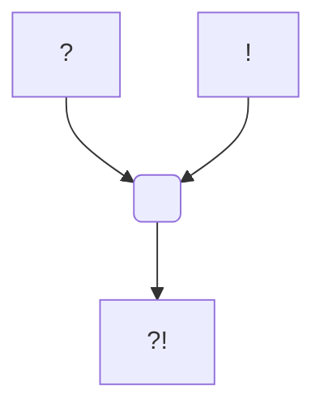

#Personnage 

# Hadriel

## Informations personnelles
### Nom Complet
### Alias
[[Édos]] (Forme divine)

### Alignement
### Status
### Naissance
### Décès
### Résidence
### Occupations

## Histoire

## Description
### Apparence

### Personnalité

## Capacités

## Relations
### Famille
### Relations amoureuses
### Amis
### Alliés et Affiliations
### Ennemis
### Autres relations

## Arbre Généalogique

## Citations

## Galerie

## Anecdotes