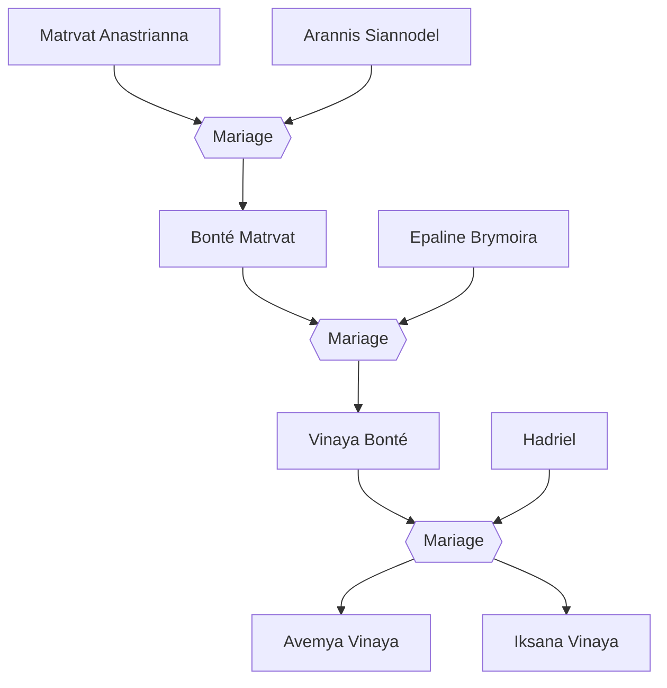

#Personnage/Mortel [[Mortel]]

# Matrvat Anastrianna

## Apparence

## Informations personnelles

### Nom Complet
Matrvat Anastrianna
### Pronoms
Elle, Féminin
### Titres
Dame Anastrianna (Titre de Noblesse)
### Alias
Annastasia Siannolia (officiellement à Whiteford)
### Type de créature
Humanoïde
### Race
Elfe du Soleil
### Classe
Niv 14 Magicienne de l'école de l'abjuration
### Alignement
Loyal Neutre
### Status
Vivante

### Naissance
66 de l'ère Kinford

### Résidence
[[Kethlone]] (Anciennement)
Amanguassuaq, [[Whitford]]

### Occupations
Suppléante du haut-fonctionnaire de [[Kethlone]] (Anciennement)

## Histoire

Toujours être droite, toujours être exemplaire, toujours être parfaite.

C'est avec cette mentalité qu'a grandi Matrvat.
Sa famille lui avait bien fait comprendre, elle était radicalement différente des autres elfes de la cité. Elle était fille de haut-fonctionnaire, et donc ses responsabilités étaient lourde alors qu'elle n'était encore qu'une simple enfant.
Très tôt, elle comprit les dangers de sa position, et donc elle prit la décision de s'inscrire dans une école de magie et suivit intensément les cours de sa mère pour apprendre comment se protéger.
À côté de ses études, elle étudiait les règles de bienséances, de discipline et autres qu'un haut-fonctionnaire devait maîtriser.

Alors que son avenir semblait tout tracé, un homme bouleversa ses plans.
Elle n'avait qu'une cinquantaine d'années lors qu'un camarade d'études avait "capturé" son regard.
Elle résonnait psychologiquement avec lui, ils étaient d'accord sur de nombreuses choses.
Il fut la légèreté et la joie de vivre qu'elle avait besoin.
Sa vision du monde, qu'il partageait avec de nombreuses illusions, était des plus admirables.

À cet instant, elle sut : Arannis était l'homme qu'elle épouserait.
Leur amour était si fort que rien pouvait les séparer.

Ils passèrent leur diplôme, et leur chemin professionnel se sépara.
Matrvat commença son travail en tant que suppléante de sa mère. Elle accumula le stress et la pression, mais seul Arannis pouvait la soulager mentalement.

Le couple déménagea officiellement à Kethlone, une décision qu'Arannis était très enthousiaste.

Ainsi pendant quelques siècles les deux amoureux vivaient d'amour et d'eau fraîche. Tout allait si bien dans leur ville recluse.
Ils décidèrent d'avoir un enfant, et ils avaient hâte de rencontrer ce nouveau membre de la famille.

Quatre siècles s'étaient écoulés depuis leur rencontre.
Matrvat était enceinte et allait bientôt accoucher, Arannis avait décidé de prendre des vacances pour s'occuper de sa femme.
L'engouement ne faisait que croître et cette envie d'être à trois les dévorait presque de l'intérieur.
Ils ne pensaient qu'à leur bébé, ils avaient pris des cours d'éducations pour être sûrs que leur enfant serait excellent dans tous les domaines académiques.

Mais hélas le destin en avait décidé autrement.

Un ancien dragon rouge vola au dessus de la ville.
Puis deux, une dizaine, une vingtaine !
Une armée entière d'anciens dragons rouges se mirent à foncer vers cette pauvre ville de Kethlone pour la réduire en cendres !
Un spectacle insensé.
Les questions se bousculèrent à la vitesse de la lumière dans la tête du couple qui fut paralysé par la peur, comme enchaînés, ils ne pouvaient même pas fuir.

En un battement de l'œil, la ville si coloré d'arbres, d'herbes, de lumière et de nature fut transformé en un enfer terrestre.
Quelqu'un devait les contrôler, un tel évènement était impossible naturellement !

Matrvat, sous le stress, perdit les eaux et dû accoucher sur le moment avec une vue des plus horrifiques.
Les nouveaux parents ne pouvaient profiter de ce qui devait être le plus beau jour de leur vie, les flammes s'emparaient de leur fille.
Cette enfant, encore si fragile, pleurait, criait de douleur, sa chair commençait à fondre et l'odeur du charbon et du sang carbonisé se mêlait à l'air.

Matrvat, dorénavant à genoux, pleurait et refusait de bouger, serrant son enfant dans ce qu'elle pensait être une dernière embrassade.
Arannis lui, fut enragé par la scène, il ne pouvait laisser voir sa progéniture se faire dévorer par les flammes. Il fouilla dans la maison bouffée par les flammes un grimoire, un parchemin, n'importe quoi de magique qui pourrait être utile.

Et heureusement il trouva un grimoire. Par chance, il avait décidé d'étudier la magie divine récemment et l'avait pris à la bibliothèque.
Il était étrangement en bon état malgré les flammes qui le couvrait.
Ni une ni deux, il le prit, l’amena à sa femme avant de l’ouvrir. Cette dernière fut dans un premier temps terrifiée, connaissant les secrets de ce grimoire, mais comprenant qu’elle n’avait pas d’autres choix si elle voulait sauver la vie de leur fille, elle hocha la tête.

Les deux ouvrirent le grimoire et tombèrent sur une page qui les interpella :
*"Rituel de renaissance à travers les flammes."*

Ils le firent sans hésiter, utilisant les cendres de leurs anciens voisins, de leurs anciens compagnons, du sang caraméliser pour dessiner le cercle, et des cadavres.

Ils chantèrent en ce qui semblait être pour eux de l'abyssal, plaçant leur enfant dans une terrible condition au centre du cercle.
Leur voix résonnèrent à travers les murs maintenant effondrés de la plaine. Les vrombissements de leur incantation faisait même trembler le sol, l'amour et le chagrin d'un couple prêt à tout déployait une force arcanique incommensurable.

Les flammes se mirent à tournoyer autour du cercle, autour du couple mains jointes, et prirent toutes les couleurs imaginables.
Peu importe où les parents posaient leurs yeux, des flammes bleues, vertes, oranges, rouges et même blanches les entouraient.

Ar’athar, maître des flammes apparut dans cette tornade de flammes.

*“Vous qui m’avez invoqué, qu’osez-vous demander ?”*

Les deux parents furent d’abord muet, la présence divine les intimidait tellement.
Mais Arannis, emporté par une passion protectrice, brisa le silence d'un air déterminé, son regard faisait face à celui de la divinité.

Il expliqua que le couple voulait sauver leur fille de cette apocalypse dont ils étaient victimes, ainsi que punir la source de ce malheur.

Ar'Athar soupira et les regarda, bien que leur intention soit des plus nobles, il se devait de les prévenir :

*"Votre lignée sera maudite pour toujours, vos enfants seront forcés de plonger leur proches dans des évènements plus que malheureux, de subir des épreuves des plus rudes tel qu'une vie paisible devra être amplement mérité pour y accéder.*
*Mais en échange, le feu se montrera comme allié, ils auront une affinités accrue à la magie et auront tout pour être des légendes.*
*Grâce à cette offrande, ce n'est pas un pacte que je vous offre, mais un contrat. Seul votre fille devra m'aider en échange de cette fraction de pouvoir divin."*

Bien évidemment, ils acceptèrent. Ils étaient prêt à tout pour sauver leur fille.

Le marché avait été conclu, Ar'athar claqua des doigts et se mit à changer. Sa respiration devint stable, elle avait l'air paisible, ses brûlures disparurent, mais sa peau changea pour prendre une couleur rouge-violacé.
Des cornes se mirent à pousser sur le crâne et une queue continua sa colonne vertébrale, ses pupilles disparurent pour laisser juste une sclère rouge-orangé.

Ar'athar disparut et avec lui les flammes et les cendres de la ville.

Les parents étaient soulagés de voir leur fille saine et sauve et prirent leur enfant maintenant tieffeline dans leur bras.

"Elle s'appellera Bonté, Bonté Matrvat pour qu'elle soit connus pour sa bienveillance et le bien qu'elle répandra."

Suite à cet incident, il était impensable pour la fille de rester sur ces terres.
Entre le fait d'avoir une famille infernal et le risque qui grouillait maintenant, il valait mieux prendre les voiles pour vivre dans une autre ville, tout en camouflant les traits infernaux qu'avait leur fille grâce à la maîtrise de l'illusion qu'avait acquit le père.

Matrvat contacta les hauts-fonctionnaires, expliquant la situation en détails de ce qu'ils venaient de leur arriver.
De par leur cas exceptionnel, ils acceptèrent de la retirer de ses fonctions officiellement, bien qu'officieusement elle pourrait toujours profiter des avantages d'un tel statut.
Le risque qu'une attaque qui prend pour cible Matrvat était trop grande, il valait mieux qu'elle soit en sécurité.

Ainsi aujourd'hui, les seules personnes connaissant le sort du couple à Maentheas sont les hauts-fonctionnaires et autres nobles. Sinon, ils apparaissent comme mort aux yeux du peuple.

## Description
### Apparence
Matrvat est une magnifique elfe du soleil à la peau de bronze, son corps possède de magnifique courbe et mesure 1m87.
Ses longs cheveux lisses tombent en bas de son dos, les racines de sa chevelure son d'un merveilleux doré, et forme un dégradé jusqu'au rouge cuivré à la pointe, donnant à ses cheveux les couleurs d'une flamme.
Tout comme son homme, de nombreux tatouages dorées parcourent son visage et son corps.
Elle porte des vêtements blancs avec des pointes rouges et dorées.
### Personnalité
Matrvat connait sa valeur, elle est stricte, sérieuse, et pour elle le travail est une valeur des plus importante.
Elle pousse ses proches à être le meilleur d'eux-mêmes. Sa discipline et sa détermination sont étonnement bienveillantes et encourageantes.
Bien qu'elle se soit attendrie depuis son enfant, elle reste une femme ferme qui obtient ce qu'elle veut.
## Capacités
Maîtresse de l'abjuration
## Relations
### Famille
[[Arannis Siannodel]] (Compagnon)
[[Bonté Matrvat]] (Fille)
[[Vinaya Bonté]] (Petite-fille)
[[Avemya Vinaya]] (Arrière-petite-fille)
[[Iksana Vinaya]] (Arrière-petite-fille)

### Alliés et Affiliations
Gouvernement Elfique de la [[Cité-État de Maentheas]] 

### Ennemis
[[Raghor Onyx]]

## Arbre Généalogique

## Citations

## Galerie

## Anecdotes
Chaque fois qu'elle se déplace avec des livres, elle les pose sur sa tête et les fait tenir en équilibre. Elle étend cette compétence à tous objets si elle est suffisamment chargée.
À cause de son lourd voyage, elle a dû accepter de changer son régime alimentaire pour y inclure de la viande. Et depuis, elle l'a complètement adopté et s'en régale.