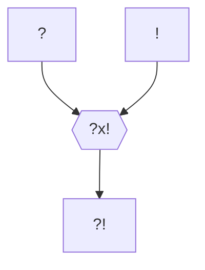

#Personnage/Mortel [[Mortel]]

## Informations personnelles
### Nom Complet
Uzad Carl Magnus Idolstadh
### Pronoms
Il/Lui
### Titres
### Alias
Le Rouge, surnom de brigand
### Type de créature
Humanoïde
### Race
Hobgoblin
### Classe
Barbare, Sentier de la Magie Sauvage
### Alignement
Chaotic neutre
### Status
Vivant
### Naissance
8 Closeporte 864 KE (34 ans)
%%### Décès
Non arrivé%%
### Résidence
Nomade
### Occupation
Brigand,
Noble (anciennement)

## Histoire
Uzad est né

## Description
### Apparence

### Personnalité

## Capacités

## Relations
### Famille
### Relations amoureuses
### Amis
### Alliés et Affiliations
### Foi
### Ennemis
### Autres relations

## Arbre Généalogique

## Citations

## Galerie

## Anecdotes