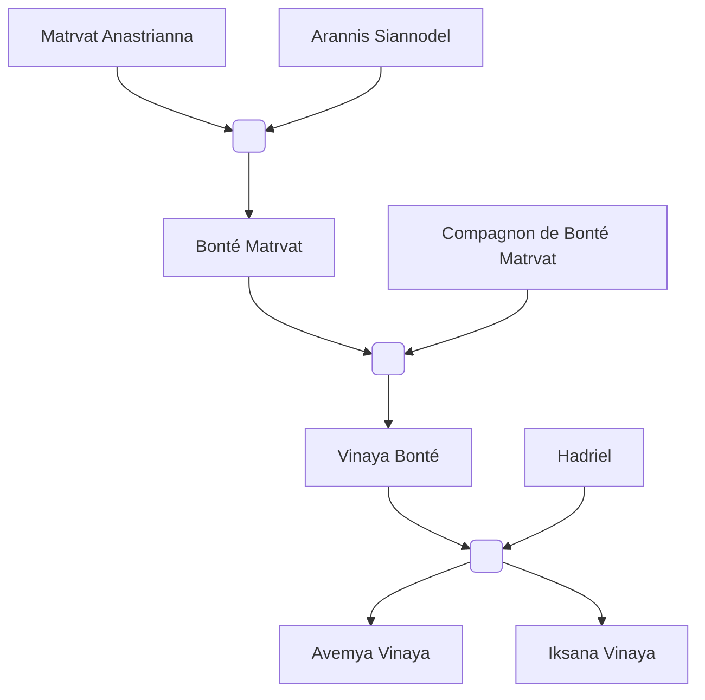

#Personnage/Mortel

# Vinaya Bonté

## Apparence

## Informations personnelles
### Nom Complet
Vinaya Bonté
### Pronoms
Elle/Féminin
### Titres
/
### Alias
/
### Type de créature
Humanoïde
### Race
Tieffeline
### Classe
Niv 18 Sorcière du brasier éternel
### Alignement
Neutre Bon
### Status
Vivante
### Naissance
650 de l'ère Kinford

### Résidence
Amanguassuaq
### Occupations
Tiens une petite boutique de potions et de soins.

## Histoire
Vinaya fut la seconde tieffeline de sa famille. Bien que son père partait souvent sur le champs de bataille, elle reçut une éducation des plus exemplaires de la part de ses deux parents.
Jusqu'à ses 14 ans, Vinaya ne montrait aucun signe de magie innée.
Sa mère était soulagée, pensant qu'elle était libéré de sa malédiction.

Vinaya, très tôt, fut très intéressée par l'herboristerie, par l'alchimie, bref la fabrication des potions, cela avait toujours été un concept qui la plaisait.
Sa mère accepta donc de l'envoyer dans une école pour qu'elle puisse développer sa passion.

Elle intégra un internat pour éviter les longues heures de voyages. Elle fut une élève brillante, son altruisme et sa tendresse la rendit bien populaire malgré le fait qu'elle soit une tieffeline.
Elle se fit de nombreux amis avec qui ses études étaient un plaisir.

Mais hélas, la jeune fille n'était pas à l'abri de la malédiction de sa lignée.

Pendant sa troisième année d'études, un ancien dragon rouge attaqua son école. 
Tout fut réduit en cendre. Vinaya était paralysée par la vue horrifique qu'était de voir tous ses camarades mourir à petit feu, hurler de douleur alors que leur se font bouffer par les flammes.
Vinaya ne ressentait rien grâce à son ascendance infernal.

Le dragon se posa non loin de la jeune tieffeline encore à genoux devant l'atrocité, un magicien descendit du dos de la bête et s'approcha de la jeune fille.
Il s'agissait du même nécromancien que sa mère avait dû combattre. Ce dernier voulait se venger de sa pseudo-défaite et confondit Vinaya avec sa mère.

Lorsque la jeune tieffeline compris ce qu'il se passait, toute la colère et la rage qu'elle avait accumulé explosa. Son pouvoir s'éveilla, ses cornes eurent une poussée de croissance, sa peau prit une teinte violette et une tâche de naissance en forme de banderole de flammes apparut, et un manteau de flamme la recouvrit.
Elle attaqua le magicien pendant une courte période, avant de se rendre compte qu'elle n'était pas de poids face à lui. Elle réussit à fuir, évitant toutes les attaques grâce à la nouvelle dextérité qu'apportait les flammes.

Elle retourna voir sa mère, lui expliqua tout ce qu'il s'était passé et lui supplia de l'aider à maîtriser son pouvoir, ce qu'elle fit.
Pendant des années, Vinaya mordit la poussière, tomba au sol, se rétamait, se faisait battre en duel, tout ça pour comprendre et maîtriser son "cœur".

Après plusieurs années à se battre lorsque Vinaya réussit enfin à blesser sa mère que cette dernière l'a jugé apte à partir le combattre.

La jeune femme réunit une compagnie de 7 aventuriers, tous prêt à l'aider dans cette tâche en plus de leur quête. 
Parmi ces aventuriers, un aasimar répondant au doux nom d'Hadriel attira le regard de cette chère Vinaya, elle en tomba follement amoureuse.

Le groupe explora terres et mers pour résoudre toutes quêtes imaginables, chassant dragons et krakens de villes, protégeant villes et villages, ce groupe devenait connu comme étant des anges sur terre. Tout ce qui était en danger était protégé lorsqu'ils étaient là.
Mais rien leur permettait de découvrir quoi que ce soit sur le nécromancien que Vinaya cherchait.

Après de très longues années, le groupe trouva enfin le nécromancien.
C'est dans une très longue bataille que le groupe s'élança, et comme avec sa mère, le nécromancien arriva à fuir avant de subir le coup fatal. Depuis, impossible de retrouver sa trace.
Alors que Vinaya voulait en arrêter là, sa faim d'aventure n'était rassasiée.

Les années passèrent, le groupe initial commença à perdre des membres, certains partaient à la retraite alors que d'autres simplement trépassaient.
Hadriel et Vinaya s'étaient rapprochés et étaient officiellement un couple.

Avec Hadriel, Vinaya s'installa à Amanguassuaq, la ville où elle était née, où tout avait commencé, pour fonder une famille.
Ils eurent deux enfants, l'une avait continué la lignée d'ensorceleur pendant que l'autre n'était qu'une tieffeline sauvée de la malédiction.

Mais hélas, Hadriel dû partir, bien sûr il en voulait autrement mais ses responsabilités vis-à-vis de ses dieux l'obligeait de reprendre la vie d'aventurier. Il laissa cependant un parchemin scellé à l'attention de sa plus jeune fille qu'il confia à Vinaya en attendant.
"Donne le à Iksana, je suis sûr qu'elle en aura besoin en tant que magicienne."

Vinaya était attristée par la nouvelle l'accepta tout de même, comprenant ce besoin de partir à l'aventure. Elle espérait avoir des nouvelles bien que ces dernières n’arrivaient jamais. 
En attendant, elle donna tout l’amour qu’elle pouvait à sa ville et sa famille, devenant une femme que les citoyens aimaient et une mère parfaite pour ses filles.
Elle reprit également ses études d'alchimie pour se lancer dans la vente de potions.
## Description
### Apparence
Vinaya ressemble énormément à sa mère, seule principale différence est la forme de ses cornes qui sont comme un bélier mais avec deux tours au lieu d'un.
Elle a également des tatouages dorées comme ses grands-parents et a un ornement en or sur la pointe de sa queue.
### Personnalité
Vinaya est douce, tendre, et est extrêmement maternel. Elle est très bienveillante et encourage tout son entourage à être le meilleur d'eux-mêmes.
Cependant, si quelqu'un ose brisé la sérénité de sa famille, Vinaya utilisera tous ses moyens pour être une femme féroce et terrifiante.
## Capacités
Maîtrise l'art de la potion
## Relations
### Famille
[[Matrvat Anastrianna]] (Grand-mère)
[[Arannis Siannodel]] (Grand-père)
[[Bonté Matrvat]]
Père non-nommé
[[Hadriel]] (Compagnon)
[[Avemya Vinaya]] (Fille)
[[Iksana Vinaya]] (Fille)
### Relations amoureuses
### Amis
### Alliés et Affiliations
### Ennemis
[[Raghor Onyx]]
### Autres relations

## Arbre Généalogique

## Citations

## Galerie

## Anecdotes
