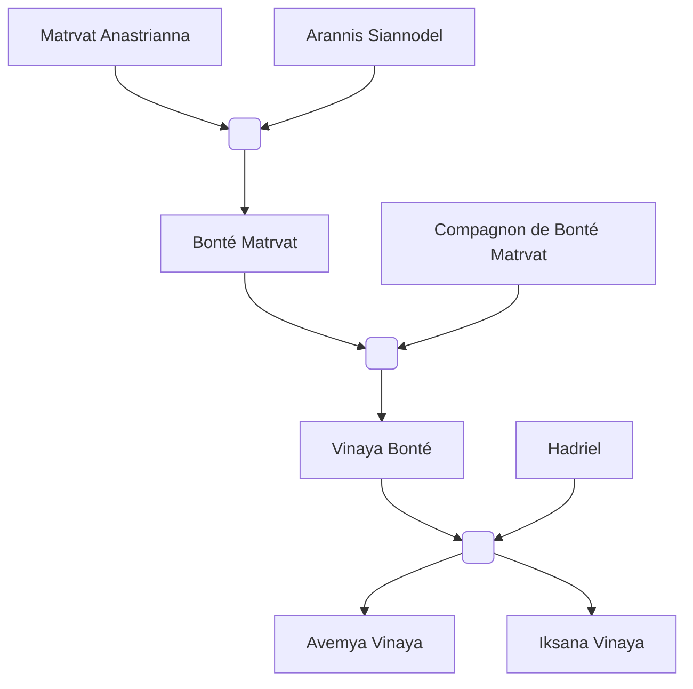

#Personnage/Mortel

# Vinaya Goodness

## Apparence

## Informations personnelles
### Nom Complet
### Pronoms
### Titres
### Alias
### Type de créature
### Race
### Classe %%(le cas échéant)%%
### Alignement
### Status
### Naissance
650 de l'ère Kinford

### Décès
### Résidence
### Occupations

## Histoire

## Description
### Apparence

### Personnalité

## Capacités

## Relations
### Famille
[[Matrvat Anastrianna]] (Grand-mère)
[[Arannis Siannodel]] (Grand-père)
[[Bonté Matrvat]]
Père non-nommé
[[Hadriel]] (Compagnon)
[[Avemya Vinaya]] (Fille)
[[Iksana Vinaya]] (Fille)
### Relations amoureuses
### Amis
### Alliés et Affiliations
### Ennemis
### Autres relations

## Arbre Généalogique

## Citations

## Galerie

## Anecdotes
